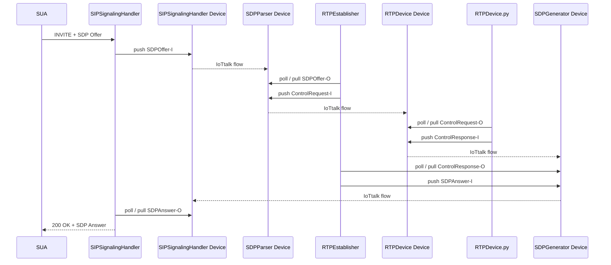
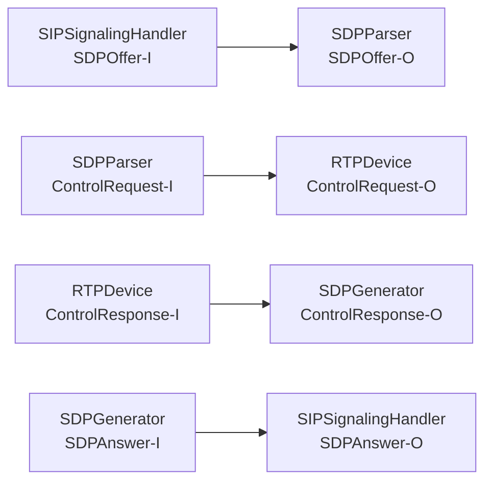
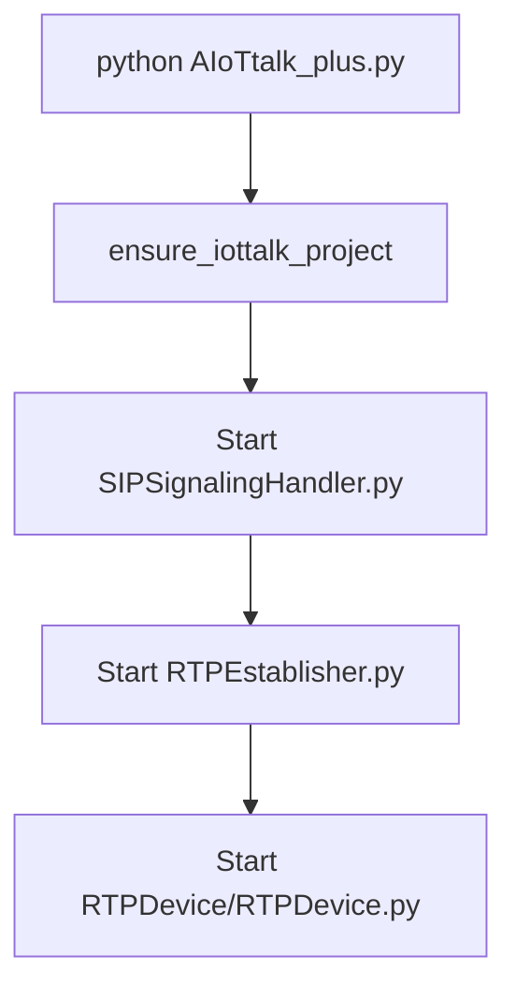
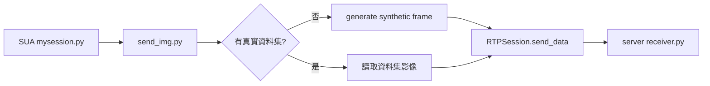
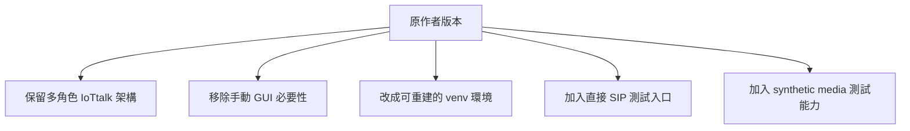

# AIoTtalk_plus 與原作者版本的差異整理

## 目的

這份文件整理目前這份 `AIoTtalk_plus` 與原作者版本相比，**實際上改了哪些地方**、**哪些地方刻意保留**、以及**目前測試是怎麼成立的**。

重點不是「全部重寫」，而是：

- 盡量保留原作者的角色分工與資料流
- 移除原本依賴手動 IoTtalk GUI 操作的部分
- 補上能在目前環境重建與測試的能力

---

## 一句話總結

目前版本可以概括成：

> **保留原作者的 4-device IoTtalk 架構與 SIP/RTP 控制流程，但把原本手動的 IoTtalk GUI 建置流程改成程式化 bootstrap，並補上可在沒有真實資料源時做 synthetic RTP 測試的能力。**

---

## 1. 保留原作者的部分

目前沒有改掉的核心設計有三個：

1. 仍然是 **多角色架構**，不是單一 mailbox 架構
2. 仍然把 **IoTtalk 當成控制平面**
3. 仍然是 **SIP -> SDPParser -> RTPDevice -> SDPGenerator -> SIP** 的閉環

### 原作者核心角色

| 角色 | 對應程式 |
|---|---|
| SIPSignalingHandler | `SIPSignalingHandler.py` |
| SDPParser | `RTPEstablisher.py` |
| SDPGenerator | `RTPEstablisher.py` |
| RTPDevice | `RTPDevice/RTPDevice.py` |

### 原作者核心 IoTtalk device

| Device Object | DM | IDF | ODF |
|---|---|---|---|
| `SIPSignalingHandler` | `SIPStream` | `SDPOffer-I` | `SDPAnswer-O` |
| `SDPParser` | `SIPStream` | `ControlRequest-I` | `SDPOffer-O` |
| `SDPGenerator` | `SIPStream` | `SDPAnswer-I` | `ControlResponse-O` |
| `RTPDevice` | `SIPStream` | `ControlResponse-I` | `ControlRequest-O` |

### 目前仍然保留的原作者資料流



---

## 2. 與原作者不同的地方

差異主要集中在 5 類：

1. IoTtalk GUI 流程改成自動化
2. 啟動入口改成單一入口
3. Python / SIP 環境改成可重建的虛擬環境
4. SUA 端改成支援直接指定 SIP 帳號測試
5. Media 測試改成支援 synthetic source

---

## 3. 差異一：IoTtalk GUI 改成自動 bootstrap

### 原作者作法

原作者的流程依賴：

- 手動進 IoTtalk GUI
- 手動建立 project
- 手動把 device object 放進去
- 手動接 flow

### 現在作法

現在由 [AIoTtalk_plus.py](/home/tim/laea/src/LAEA/AIoTtalk_plus/AIoTtalk_Server/AIoTtalk_plus/AIoTtalk_plus.py) 啟動前自動執行 [iottalk_project_bootstrap.py](/home/tim/laea/src/LAEA/AIoTtalk_plus/AIoTtalk_Server/AIoTtalk_plus/iottalk_project_bootstrap.py)。

它會自動完成：

- 檢查 project 是否存在
- 不存在就建立
- 檢查 4 個 device object 是否存在
- 不存在就建立
- 檢查 4 條 connection 是否存在
- 不存在就建立
- 最後自動 `restart_project`

### 目前自動建立的 project

預設名稱定義在 [config.py](/home/tim/laea/src/LAEA/AIoTtalk_plus/AIoTtalk_Server/AIoTtalk_plus/config.py)：

```python
"ProjectName": os.environ.get("AIOTTALK_PLUS_PROJECT_NAME", "AIoTtalk_plus_Auto")
```

### 自動建立的 flow



### 這一類變更的意義

這是目前**相對原作者最大的改動**，但它改的是「操作方式」，不是「資料流本身」。

也就是：

- **架構保留**
- **GUI 手動步驟移除**

---

## 4. 差異二：server 端改成單一啟動入口

### 原作者作法

原作者需要分別啟動：

- `SIPSignalingHandler.py`
- `RTPEstablisher.py`
- `RTPDevice.py`

### 現在作法

現在透過 [AIoTtalk_plus.py](/home/tim/laea/src/LAEA/AIoTtalk_plus/AIoTtalk_Server/AIoTtalk_plus/AIoTtalk_plus.py) 統一啟動。

它會：

1. 先做 IoTtalk bootstrap
2. 再依序拉起
   - `SIPSignalingHandler.py`
   - `RTPEstablisher.py`
   - `RTPDevice/RTPDevice.py`

### 現在的啟動流程



### 這一類變更的意義

這屬於**部署與操作優化**，不是架構重寫。

---

## 5. 差異三：Python / SIP 環境改成可重建的 venv

### 原作者作法

原作者版本偏向：

- 依賴系統安裝的 `sipsimple`
- 直接覆蓋安裝路徑裡的 `sipsimple/session.py`

### 現在作法

目前改成：

- 使用虛擬環境 [`/home/tim/laea/src/LAEA/.venv_aiottalk_plus`](/home/tim/laea/src/LAEA/.venv_aiottalk_plus)
- 在這個 venv 中放置需要的 `python3-sipsimple`
- 再把 server 用的 [session.py](/home/tim/laea/src/LAEA/AIoTtalk_plus/AIoTtalk_Server/AIoTtalk_plus/session.py) 覆蓋到 venv 的 `sipsimple/session.py`

### 這一類變更的意義

這一類改動主要是為了：

- 讓環境可以重建
- 不污染 system Python
- 降低交接成本

這不是原作者資料流上的改動，而是**環境管理方式的改動**。

---

## 6. 差異四：SUA 端加入直接測試模式

### 原作者作法

原本 SUA 端傾向透過 `request_join()` 從外部服務拿 SIP account。

### 現在作法

目前 [rtpua_sip_application.py](/home/tim/laea/src/LAEA/AIoTtalk_plus/SUA/rtp_SUA/rtpua_sip_application.py) 支援兩種模式：

1. 原本模式：`--use-ofl-join`
2. 測試模式：直接指定 `--sip-account` 與 `--target`

### 現在的測試命令

```bash
python -u rtpua_sip_application.py \
  --sip-account devicetest1@140.114.77.72 \
  --target siptalktest@140.114.77.72
```

### 這一類變更的意義

這是**測試入口優化**，不是原作者主流程的改寫。

---

## 7. 差異五：media 測試加入 synthetic mode

### 原作者作法

原作者的 sender / receiver 假設：

- 有資料集
- 有 `cv2`
- 有 `ultralytics`

也就是偏向「完整 AI/media 環境已存在」。

### 現在作法

目前為了能在**沒有真實資料源**時先測整條 RTP 鏈，做了兩個調整：

1. [send_img.py](/home/tim/laea/src/LAEA/AIoTtalk_plus/AIoTtalk_plus_Lib/example/send_data/send_img.py)
   - 若沒有資料集、沒有 `cv2`、沒有 `ultralytics`
   - 自動切成 **Synthetic media mode**
   - 直接產生測試 frame 送出
2. [receiver.py](/home/tim/laea/src/LAEA/AIoTtalk_plus/AIoTtalk_plus_Lib/example/receiver.py)
   - 若沒有 `cv2`
   - 仍可接收資料，不會因寫檔失敗而整個崩掉

### 現在的 synthetic media 路徑



### 這一類變更的意義

這是**測試能力的補強**。  
目的是讓 SIP / IoTtalk / RTP 鏈可以在沒有真實 source 的情況下先驗證通。

---

## 8. 差異六：SDP / H264 參數處理補強

### 原作者狀態

原始流程中，SDP `fmtp` 的處理較弱，對多個 H264 參數支援不足。

### 現在作法

目前 server 與 client 兩邊的 SDP parser 都已補強，可處理：

- `profile-level-id`
- `packetization-mode`
- `resolution`

對應檔案：

- server: [utils/sdp_process.py](/home/tim/laea/src/LAEA/AIoTtalk_plus/AIoTtalk_Server/AIoTtalk_plus/utils/sdp_process.py)
- client: [sdp_process.py](/home/tim/laea/src/LAEA/AIoTtalk_plus/SUA/rtp_SUA/sdp_process.py)

### 現在 client 送出的 H264 SDP

```sdp
a=rtpmap:96 H264/90000
a=sendonly
a=fmtp:96 profile-level-id=42e01f; packetization-mode=1; resolution=1400*788
```

### 這一類變更的意義

這是為了讓目前的 H264 測試更穩，屬於**兼容性修正**。

---

## 9. 差異七：session / device bank cleanup 補強

### 原作者問題

在重複測試時，同一個 SIP device 可能殘留在 `device_bank`，下一通進來時被判成舊 session。

### 現在作法

在 [RTPEstablisher.py](/home/tim/laea/src/LAEA/AIoTtalk_plus/AIoTtalk_Server/AIoTtalk_plus/RTPEstablisher.py) 補了 stale mapping 處理：

- 若同一 SIP device 又進來
- 先送舊的 `disconnect`
- 再刪掉舊 mapping
- 最後建立新的 mapping

這讓重跑測試時不會直接卡在：

```text
SIP device ... is already in the Device Bank
```

---

## 10. 目前與原作者差異的總表

| 面向 | 原作者 | 目前版本 |
|---|---|---|
| IoTtalk project / flow | 手動 GUI 建立 | 啟動前自動 bootstrap |
| 角色分工 | 多 device，多角色 | 保留原作者多 device，多角色 |
| 啟動方式 | 多支程式分開啟動 | `AIoTtalk_plus.py` 單一入口 |
| Python 環境 | 偏 system-level 安裝 | 單一 venv，可重建 |
| SIP session patch | 覆蓋系統 `sipsimple/session.py` | 覆蓋 venv 內 `sipsimple/session.py` |
| SUA 帳號取得 | 偏 `request_join()` | 可直接 `--sip-account` 測試 |
| Media 測試 | 假設真實 source 與完整依賴 | 支援 synthetic media mode |
| SDP fmtp | 多參數支援較弱 | 已補強 H264 fmtp parsing |
| 重跑穩定性 | 容易殘留 stale state | 補了 stale device bank 處理 |

---

## 11. 目前已經驗證成功的內容

目前已成功驗證：

1. `AIoTtalk_plus.py` 可自動建立 / 重用 IoTtalk project 與 4 條 flow
2. server 可正常啟動 `SIPSignalingHandler`、`RTPEstablisher`、`RTPDevice`
3. SUA 可直接用固定 SIP 帳號發起呼叫
4. SIP session 可進到 `connected`
5. RTP session 可建立
6. 在沒有真實資料源時，可進 synthetic media mode
7. server receiver 可實際收到資料

---

## 12. 目前還不是「完全原作者」的地方

這幾點需要明確知道：

1. **IoTtalk GUI 不再是必要操作入口**
   - 這是刻意改掉的
2. **測試資料流可用 synthetic frame**
   - 這是為了 debug 與交接方便加的
3. **環境管理改成 venv**
   - 這是為了讓目前這台機器可重建
4. **SUA 測試模式不再依賴一定要走 OFL join**
   - 這是為了減少外部服務對基本測試的干擾

---

## 13. 建議如何解讀目前這份版本

這份版本不是：

> 「完全照抄原作者、不做任何改動」

它比較像：

> 「保留原作者架構與控制流程，但把原本不利於重建與測試的部分改成程式化、自動化、可在現場驗證的版本」

---

## 14. 如果要再往下分

後續可把改動分成兩層看：

### A. 必要改動

- IoTtalk bootstrap
- venv 環境重建
- SUA 直接測試入口
- SDP 兼容性修正

### B. 測試輔助改動

- synthetic media mode
- receiver 在沒有 `cv2` 時不崩潰
- stale session cleanup

---

## 15. 最後總結

目前這份 `AIoTtalk_plus` 相對原作者版本的差異，主軸是：



也就是：

- **架構盡量保留原作者**
- **操作與測試方式做了工程化改良**

