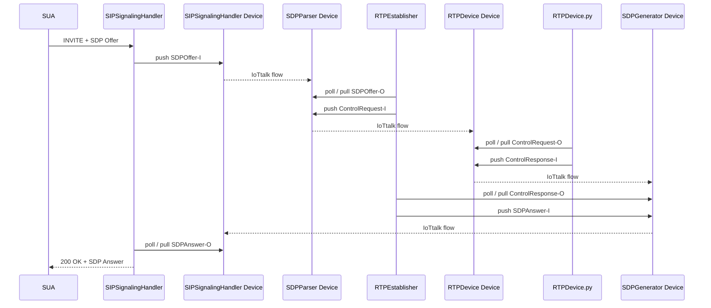
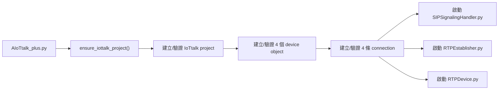
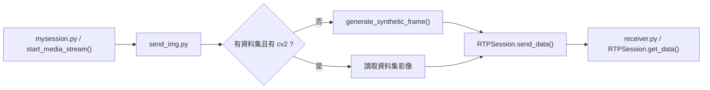
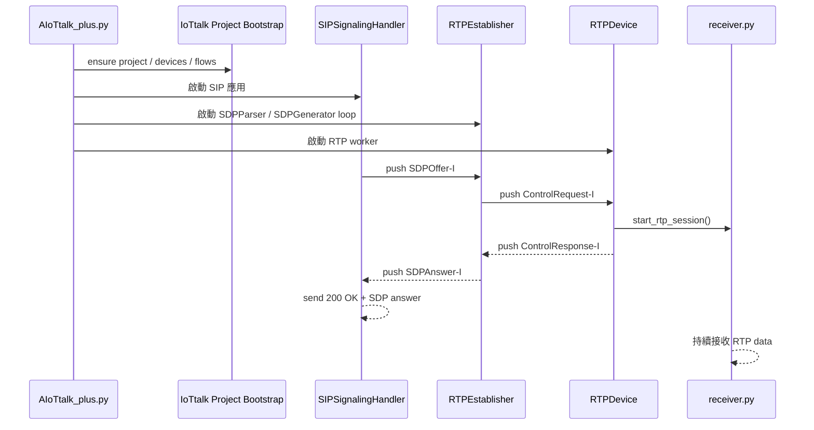
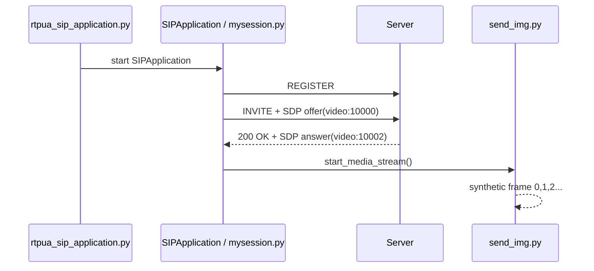

# AIoTtalk_plus 相對原作者版本之改動報告

## 1. 文件目的

本文件用於說明目前 `AIoTtalk_plus` 與原作者版本相比的**實際改動**、**保留的原始架構**、**對應程式碼位置**與**目前驗證結果**。

本次整理的原則如下：

1. 盡量保留原作者的 `SIPSignalingHandler -> SDPParser/SDPGenerator -> RTPDevice` 架構。
2. 將原本依賴手動 IoTtalk GUI 建置 project / device / flow 的流程改為自動化。
3. 保留原作者 SIP/RTP 基本流程，但補足目前環境下的相容性與測試能力。

---

## 2. 執行摘要

### 2.1 核心結論

目前版本不是重新設計整套系統，而是：

> **保留原作者的多角色 IoTtalk 控制流程，將手動 GUI 操作改為程式化 bootstrap，並補上可在無真實資料源情況下進行 synthetic RTP 測試的能力。**

### 2.2 與原作者最大的差別

| 面向 | 原作者版本 | 目前版本 |
|---|---|---|
| IoTtalk project / flow | 手動經 GUI 建立 | 啟動時自動建立 / 驗證 |
| 啟動方式 | 多支程式分開啟動 | `AIoTtalk_plus.py` 單一入口 |
| Python 環境 | 偏 system-level 安裝與覆蓋 | 改為單一 venv，可重建 |
| SUA 測試 | 傾向依賴 `request_join()` | 可直接指定 `--sip-account` / `--target` |
| Media 測試 | 預設假設真實資料源與完整依賴 | 支援 synthetic media mode |
| SDP fmtp 解析 | H264 多參數支援較弱 | 已補強 `profile-level-id` / `packetization-mode` / `resolution` |

### 2.3 目前已驗證成功

| 項目 | 狀態 |
|---|---|
| IoTtalk project 自動建立 | 已通過 |
| IoTtalk 4 個 device object 自動建立 | 已通過 |
| IoTtalk 4 條 flow 自動建立 | 已通過 |
| SIP 註冊 | 已通過 |
| SIP session `connected` | 已通過 |
| RTP session 建立 | 已通過 |
| 無真實資料源下 synthetic video 測試 | 已通過 |
| server receiver 收到 RTP 資料 | 已通過 |

---

## 3. 原作者架構與目前架構比較

### 3.1 原作者核心資料流

### 3.2 目前版本的核心資料流

資料流本身仍與原作者一致，差異主要在於 **IoTtalk topology 由程式自動建立**，而不再由 GUI 手動建立。

### 3.3 保留與修改的邊界

| 類別 | 是否保留原作者 |
|---|---|
| 角色分工 | 保留 |
| IoTtalk 多 device / 多 DF 架構 | 保留 |
| SIP -> SDP -> RTP -> SDP Answer 閉環 | 保留 |
| GUI 手動建置 | 改為自動化 |
| system-level Python 環境 | 改為 venv |
| 無資料源測試能力 | 新增 |

---

## 4. 改動項目總表

| 編號 | 改動項目 | 目的 | 影響層 |
|---|---|---|---|
| C1 | IoTtalk project bootstrap | 移除手動 GUI 建置 | 架構 / 部署 |
| C2 | server 單一啟動入口 | 降低啟動複雜度 | 啟動流程 |
| C3 | 單一 venv 重建環境 | 降低環境污染與重建成本 | 環境管理 |
| C4 | SUA CLI 測試模式 | 降低對外部 OFL service 的依賴 | 測試入口 |
| C5 | SDP fmtp 多參數解析 | 提升 H264 協商穩定性 | SIP / SDP |
| C6 | RTPDevice 啟動與 stale session 修正 | 提升 RTP 建立穩定性 | RTP / 控制流 |
| C7 | synthetic media mode | 無真實資料源時仍可驗證 RTP 鏈 | 測試能力 |

---

## 5. 詳細改動說明

## 5.1 C1: IoTtalk project bootstrap

### 原作者方式

原作者流程依賴使用者手動進入 IoTtalk GUI，完成：

1. 建立 project
2. 建立 device object
3. 建立 connection / flow

### 目前方式

目前改為由程式在啟動前自動完成上述流程。

### 改動內容

| 項目 | 說明 |
|---|---|
| 預設 project 名稱 | `AIoTtalk_plus_Auto` |
| 預設 project API port | `7788` |
| 建立 device object | `SIPSignalingHandler`、`SDPParser`、`SDPGenerator`、`RTPDevice` |
| 建立 connection | `SIPOfferToParser`、`ParserToRTPDevice`、`RTPDeviceToGenerator`、`GeneratorToSIPAnswer` |

### 程式碼位置

| 檔案 | 內容 |
|---|---|
| `AIoTtalk_Server/AIoTtalk_plus/config.py:4` | 定義 IoTtalk project 相關設定與 4 個 device / 4 條 connection |
| `AIoTtalk_Server/AIoTtalk_plus/iottalk_project_bootstrap.py:34` | `IoTtalkProjectBootstrap` 主類別 |
| `AIoTtalk_Server/AIoTtalk_plus/iottalk_project_bootstrap.py:68` | `ensure_project()` |
| `AIoTtalk_Server/AIoTtalk_plus/iottalk_project_bootstrap.py:182` | `ensure_devices()` |
| `AIoTtalk_Server/AIoTtalk_plus/iottalk_project_bootstrap.py:191` | `ensure_connections()` |
| `AIoTtalk_Server/AIoTtalk_plus/iottalk_project_bootstrap.py:253` | `_bootstrap_project()` |
| `AIoTtalk_Server/AIoTtalk_plus/iottalk_project_bootstrap.py:280` | `ensure_iottalk_project()` |

---

## 5.2 C2: server 改為單一啟動入口

### 原作者方式

需分別啟動：

- `SIPSignalingHandler.py`
- `RTPEstablisher.py`
- `RTPDevice.py`

### 目前方式

統一由 `AIoTtalk_plus.py` 啟動，並在啟動前先執行 IoTtalk bootstrap。

### 程式碼位置

| 檔案 | 內容 |
|---|---|
| `AIoTtalk_Server/AIoTtalk_plus/AIoTtalk_plus.py:13` | `start_process()` |
| `AIoTtalk_Server/AIoTtalk_plus/AIoTtalk_plus.py:19` | `terminate_all_proc()` |
| `AIoTtalk_Server/AIoTtalk_plus/AIoTtalk_plus.py:45` | 啟動前執行 `ensure_iottalk_project()` |
| `AIoTtalk_Server/AIoTtalk_plus/AIoTtalk_plus.py:58` | 啟動 `SIPSignalingHandler.py` |
| `AIoTtalk_Server/AIoTtalk_plus/AIoTtalk_plus.py:60` | 啟動 `RTPEstablisher.py` |
| `AIoTtalk_Server/AIoTtalk_plus/AIoTtalk_plus.py:62` | 啟動 `RTPDevice/RTPDevice.py` |

---

## 5.3 C3: Python 環境改成 venv

### 原作者方式

原作者版本偏向直接使用系統 Python 環境與已安裝的 `sipsimple`，再覆蓋其 `session.py`。

### 目前方式

目前改為使用單一虛擬環境：

- `/.venv_aiottalk_plus`

這樣做的原因是：

1. 減少污染 system Python
2. 讓環境重建可重複
3. 方便交接

### 影響

這一類改動主要是**環境管理方式的改動**，不直接改變原作者資料流。

---

## 5.4 C4: SUA 端加入直接測試模式

### 原作者方式

SUA 偏向透過 `request_join()` 向外部服務取得 SIP account。

### 目前方式

新增 CLI 模式，可直接指定：

- `--sip-account`
- `--target`

僅在需要時才使用 `--use-ofl-join`。

### 程式碼位置

| 檔案 | 內容 |
|---|---|
| `SUA/rtp_SUA/rtpua_sip_application.py:365` | CLI argument parser |
| `SUA/rtp_SUA/rtpua_sip_application.py:381` | 檢查 `--sip-account` / `--use-ofl-join` |
| `SUA/rtp_SUA/rtpua_sip_application.py:389` | `--use-ofl-join` 流程 |
| `SUA/rtp_SUA/rtpua_sip_application.py:403` | 直接使用指定 SIP account / target 啟動 |

---

## 5.5 C5: SDP / H264 fmtp 多參數解析補強

### 問題

原流程中，`fmtp` 僅能可靠處理單一參數，對 H264 常見參數的支援不足。

### 目前處理

現在已支援：

- `profile-level-id`
- `packetization-mode`
- `resolution`

### server 端程式碼位置

| 檔案 | 內容 |
|---|---|
| `AIoTtalk_Server/AIoTtalk_plus/utils/sdp_process.py:25` | 補 `origin_ip_address` |
| `AIoTtalk_Server/AIoTtalk_plus/utils/sdp_process.py:116` | `fmtp` 多參數解析 |
| `AIoTtalk_Server/AIoTtalk_plus/utils/sdp_process.py:150` | `generate_sdp()` |
| `AIoTtalk_Server/AIoTtalk_plus/utils/sdp_process.py:179` | `fmtp` 多參數重新組裝 |

### client 端程式碼位置

| 檔案 | 內容 |
|---|---|
| `SUA/rtp_SUA/sdp_process.py:24` | 補 `origin_ip_address` |
| `SUA/rtp_SUA/sdp_process.py:115` | `fmtp` 多參數解析 |
| `SUA/rtp_SUA/sdp_process.py:149` | `generate_sdp()` |

### 主叫端 SDP 產生位置

| 檔案 | 內容 |
|---|---|
| `SUA/rtp_SUA/mysession.py:2839` | `generate_sdp()` |
| `SUA/rtp_SUA/mysession.py:2849` | H264 `fmtp` 設定 |
| `SUA/rtp_SUA/provider_session.py:1034` | provider 端 `generate_sdp()` |
| `SUA/rtp_SUA/provider_session.py:1044` | provider 端 H264 `fmtp` 設定 |

---

## 5.6 C6: RTPDevice 啟動與 stale session 修正

### 修正一：RTP receiver 啟動路徑

原本 `RTPDevice.py` 直接用相對路徑呼叫 receiver，容易因工作目錄不同而失敗。

目前改為：

- 用 `os.path.dirname(__file__)` 推出絕對路徑
- 用 `sys.executable` 啟動 Python script

### 修正二：欄位對齊

原本 `RTPDevice.py` 會直接存取不存在的欄位，造成例外。

目前改為與 `parse_sdp()` 的輸出欄位對齊。

### 修正三：stale device bank

若相同 SIP device 再次進來，先送出舊的 disconnect，再刪除舊 mapping，避免卡在殘留狀態。

### 程式碼位置

| 檔案 | 內容 |
|---|---|
| `AIoTtalk_Server/AIoTtalk_plus/RTPDevice/RTPDevice.py:31` | `RTPDevice` 類別 |
| `AIoTtalk_Server/AIoTtalk_plus/RTPDevice/RTPDevice.py:79` | `connect` request 處理 |
| `AIoTtalk_Server/AIoTtalk_plus/RTPDevice/RTPDevice.py:139` | `start_rtp_session()` |
| `AIoTtalk_Server/AIoTtalk_plus/RTPDevice/RTPDevice.py:162` | receiver 腳本絕對路徑 |
| `AIoTtalk_Server/AIoTtalk_plus/RTPEstablisher.py:69` | `push_iottalk_data()` |
| `AIoTtalk_Server/AIoTtalk_plus/RTPEstablisher.py:205` | stale mapping / disconnect 邏輯 |
| `AIoTtalk_Server/AIoTtalk_plus/RTPEstablisher.py:225` | 重新解析並建立 connect request |
| `AIoTtalk_Server/AIoTtalk_plus/RTPEstablisher.py:296` | 接收 `connect` response 並回推 SDP answer |

---

## 5.7 C7: synthetic media mode

### 目的

在沒有真實資料源、沒有 `cv2`、沒有資料集、沒有 `ultralytics` 的情況下，仍能驗證 RTP 鏈路是否正常。

### 做法

#### sender 端

- 若無資料集或無 `cv2`
- 自動切入 synthetic mode
- 直接產生測試 frame 並送出

#### receiver 端

- 若沒有 `cv2`
- 仍可持續接收資料
- 不因寫檔失敗而中止

### 程式碼位置

| 檔案 | 內容 |
|---|---|
| `AIoTtalk_plus_Lib/example/send_data/send_img.py:2` | `cv2` optional import |
| `AIoTtalk_plus_Lib/example/send_data/send_img.py:43` | `get_resolution_from_media()` |
| `AIoTtalk_plus_Lib/example/send_data/send_img.py:52` | `generate_synthetic_frame()` |
| `AIoTtalk_plus_Lib/example/send_data/send_img.py:107` | 判斷 `synthetic_mode` |
| `AIoTtalk_plus_Lib/example/send_data/send_img.py:131` | synthetic mode 主迴圈 |
| `AIoTtalk_plus_Lib/example/receiver.py:2` | `cv2` optional import |
| `AIoTtalk_plus_Lib/example/receiver.py:70` | receiver 持續讀取 RTP data |
| `AIoTtalk_plus_Lib/example/receiver.py:76` | 若有 `cv2` 才輸出圖片檔 |

### synthetic mode 流程圖

---

## 6. 重要檔案與用途對照

| 檔案 | 用途 | 是否相對原作者有改動 |
|---|---|---|
| `AIoTtalk_Server/AIoTtalk_plus/config.py` | IoTtalk project / device / flow 設定 | 是 |
| `AIoTtalk_Server/AIoTtalk_plus/iottalk_project_bootstrap.py` | 自動建立 IoTtalk project / device / flow | 新增 |
| `AIoTtalk_Server/AIoTtalk_plus/AIoTtalk_plus.py` | 單一 server 啟動入口 | 是 |
| `AIoTtalk_Server/AIoTtalk_plus/RTPEstablisher.py` | SDPParser / SDPGenerator 與 device bank 邏輯 | 是 |
| `AIoTtalk_Server/AIoTtalk_plus/RTPDevice/RTPDevice.py` | RTP receiver 控制 | 是 |
| `AIoTtalk_Server/AIoTtalk_plus/utils/sdp_process.py` | server 端 SDP parse / generate | 是 |
| `SUA/rtp_SUA/rtpua_sip_application.py` | SUA 啟動入口與 CLI 模式 | 是 |
| `SUA/rtp_SUA/mysession.py` | client 端 SDP offer 與 media sender 啟動 | 是 |
| `SUA/rtp_SUA/provider_session.py` | provider 端 SDP offer | 是 |
| `SUA/rtp_SUA/sdp_process.py` | client 端 SDP parse / generate | 是 |
| `AIoTtalk_plus_Lib/example/send_data/send_img.py` | sender 測試程式 | 是 |
| `AIoTtalk_plus_Lib/example/receiver.py` | receiver 測試程式 | 是 |

---

## 7. 目前測試結果與解讀

### 7.1 已成功驗證

| 測試項目 | 結果 | 證據 |
|---|---|---|
| IoTtalk project 建立 | 成功 | `IoTtalk project ready: AIoTtalk_plus_Auto` |
| 4 個 device object 建立 | 成功 | 啟動時對 4 組 profile `POST` 皆回 `200` |
| SIP 註冊 | 成功 | `SIPAccountRegistrationDidSucceed` |
| SIP INVITE / 200 OK | 成功 | client 端 `outgoing -> early -> connecting -> connected` |
| server session 建立 | 成功 | `SIPSessionDidStart` |
| RTP session 建立 | 成功 | `Create stream payload type id: 96` |
| synthetic sender 啟動 | 成功 | `Synthetic media mode enabled` |
| server receiver 收到資料 | 成功 | `rgb_images: 1` |

### 7.2 目前仍存在但不阻塞主流程的現象

| 現象 | 說明 |
|---|---|
| `Decode error!` | 啟動初期解碼訊息，但後續已有 `rgb_images: 1`，表示 receiver 已收到資料 |
| `Time out for reinvite!` | session lifecycle 收尾仍不乾淨 |
| `Unkown param: packetization-mode / profile-level-id` | 底層 RTP C++ library 未特別處理這兩個參數，但目前不阻塞串流 |
| Ctrl+C 時 thread traceback | 結束階段清理不乾淨，屬於收尾問題 |

---

## 8. 結論

### 8.1 對原作者架構的影響

目前版本：

- **保留了原作者的 4-device IoTtalk 架構**
- **保留了原作者的 SIP -> SDP -> RTP -> SDP Answer 控制流程**
- **沒有改成單一 mailbox 架構**

### 8.2 真正被改掉的是什麼

真正被改掉的是：

1. **IoTtalk GUI 的手動建置方式**
2. **system-level Python / SIP 環境依賴**
3. **測試時對真實資料源與完整 AI 依賴的強需求**

### 8.3 最終判斷

本版本可描述為：

> **基於原作者架構的工程化版本。**
>
> 它沒有改掉原作者的控制流程，但將原本難以重建、難以交接、難以無 source 測試的部分改為自動化與可驗證的形式。

---

## 9. Server 端輸出逐段解讀

本節將一次成功執行的 server log 依照實際流程拆開說明。重點不是逐字翻譯，而是指出：

1. 該段輸出代表哪個模組正在工作
2. 它在整個 `SIP -> IoTtalk -> RTP -> SDP Answer` 流程中的位置
3. 該段輸出是否代表成功、警告、或後續待收尾項目

### 9.1 server 端整體流程圖

### 9.2 啟動與 IoTtalk bootstrap 階段

| 輸出片段 | 代表意義 | 判讀 |
|---|---|---|
| `IoTtalk project ready: AIoTtalk_plus_Auto (p_id=141)` | `AIoTtalk_plus.py` 啟動後先呼叫 IoTtalk bootstrap，確認 project 已存在且可用 | 正常，表示不需要手動進 GUI 建 project |
| `MonkeyPatchWarning ... monkey-patching ssl after ssl has already been imported` | `gevent` 的警告，表示 monkey patch 的時機不是最早 | 警告，不阻塞主流程 |
| `{'profile': ... 'd_name': 'SIPSignalingHandler' ...}` + `200` | 自動註冊/確認 `SIPSignalingHandler` 這個 IoTtalk device object | 正常，`200` 表示 IoTtalk 接受 |
| `{'profile': ... 'd_name': 'SDPParser' ...}` + `200` | 自動註冊/確認 `SDPParser` device object | 正常 |
| `{'profile': ... 'd_name': 'SDPGenerator' ...}` + `200` | 自動註冊/確認 `SDPGenerator` device object | 正常 |
| `{'profile': ... 'd_name': 'RTPDevice' ...}` + `200` | 自動註冊/確認 `RTPDevice` device object | 正常 |

這一段代表：**IoTtalk project、device object、connection 已就緒，server 不需要人工進 GUI 檢查與接線。**

### 9.3 SIP 應用與背景 thread 啟動階段

| 輸出片段 | 代表意義 | 判讀 |
|---|---|---|
| `notification handler: SIPApplicationWillStart` | `sipsimple` SIP 應用開始啟動 | 正常 |
| `Using account siptalktest@140.114.77.72` | server 端使用的 SIP account | 正常 |
| `notification handler: SIPApplicationDidStart!` | SIP 應用已完成初始化 | 正常 |
| `Start get_sdp_answer_thread` | `SIPSignalingHandler` 開始背景輪詢 `SDPAnswer-O` | 正常，這是原作者流程的 polling 部分 |
| `notification handler: SIPAccountRegistrationDidSucceed!` | server 端已向 SIP server 完成註冊 | 正常 |
| `Start pull sdp offer thread` | `RTPEstablisher` 開始輪詢 `SDPOffer-O` | 正常 |
| `Start push control request thread` | `RTPEstablisher` 準備將解析後的控制請求推到 `ControlRequest-I` | 正常 |
| `Start pull control response thread` | `RTPEstablisher` 開始輪詢 `ControlResponse-O` | 正常 |
| `Start push sdp answer thread` | `RTPEstablisher` 準備將產生的 SDP answer 推回 IoTtalk | 正常 |
| `Serving Flask app 'RTPEstablisher'` / `Running on ...:3003` | `RTPEstablisher` 附帶啟動一個 Flask app，通常用於狀態觀察或其他本地 API | 正常，但 `werkzeug` 明確指出這是 development server |

這一段代表：**server 三個角色已經全部啟動，而且各自的 polling thread 已開始工作。**

### 9.4 收到來電與解析 SDP Offer 階段

| 輸出片段 | 代表意義 | 判讀 |
|---|---|---|
| `notification handler: SIPSessionNewIncoming!` | server 收到新的 incoming SIP INVITE | 正常 |
| `{'devicetest1@140.114.77.72': <sipsimple.session.Session ...>}` | server 端將此 SIP device 與 session object 暫存在 session 表中 | 正常 |
| `Entering SIPSessionNewIncoming handler for session: devicetest1@140.114.77.72` | 進入專案自訂的 incoming call handler | 正常 |
| `_NH_SIPInvitationChangedState!` | `sipsimple` invitation state 發生改變 | 正常 |
| `pre_message not equal to message` | 內部用來避免重複處理同一段訊息的比較結果 | 正常，表示不是舊訊息重入 |
| `Got new sdp request` | `SIPSignalingHandler` 已將 remote SDP offer 送入 IoTtalk，`RTPEstablisher` 成功拉到資料 | 正常 |
| `['devicetest1@140.114.77.72', 'v=0 ...']` | 這是推入/拉出的 payload 形式：`[sip_device_id, raw_sdp]` | 正常 |
| 之後印出的整段 `v=0 ... a=fmtp:96 ...` | 這是 client 送來的 raw SDP offer | 正常，後續會被 parse 成結構化資料 |
| `SDPMediaStream(...)` | `sipsimple` 對該 media line 的內部表示 | 正常 |
| `{'media_type': 'video', 'port': 10000, ...}` | server 端 `parse_sdp()` 後得到的結構化結果 | 正常，已成功辨識 video/H264/port 10000/sendonly |

這一段代表：**SIP offer 已成功從 `SIPSignalingHandler` 交棒到 `RTPEstablisher`。**

### 9.5 RTP worker 選擇與 Device Bank 階段

| 輸出片段 | 代表意義 | 判讀 |
|---|---|---|
| `Find SIP device devicetest1@140.114.77.72 for connecting RTP device RTPDevice1` | `RTPEstablisher` 根據 mapping table，決定此 SIP device 要交給 `RTPDevice1` | 正常 |
| `SIP Device ... insert into Device Bank` | 將此次 SIP session 與對應 RTP worker 存入 device bank | 正常 |
| `{'devicetest1@140.114.77.72': ['RTPDevice1', ...]}` | 顯示目前 device bank 狀態 | 正常 |
| `-------- Got control request ---------` | `RTPDevice` 已從 IoTtalk 收到 `ControlRequest-O` | 正常 |
| `RTPDevice1 connect devicetest1@140.114.77.72` | `RTPDevice1` 準備為該 SIP session 建立 RTP 接收端 | 正常 |

這一段代表：**IoTtalk 中間的 `SDPParser -> RTPDevice` 這條 flow 已成功工作。**

### 9.6 RTP 參數展開與 receiver 建立階段

| 輸出片段 | 代表意義 | 判讀 |
|---|---|---|
| `origin_ip: 140.114.77.74` / `session_name: SLAMDevice` | `RTPDevice` 將 SDP 中的重要欄位拆出來 | 正常 |
| `ip_address: 140.114.77.74` | remote sender 的 IP | 正常 |
| `media_type: video` | 此次媒體型別為 video | 正常 |
| `direction: sendonly` | 對方 SDP offer 表示 client 只送不收 | 正常 |
| `sip_device_media_port: 10000` | 對方將從 UDP 10000 發送 RTP | 正常 |
| `start_rtp_session` | `RTPDevice` 準備啟動本地 receiver | 正常 |
| `Got Local device params:` | 本地 receiver 的 SDP 參數，這次會用 `recvonly`、port `10002` | 正常 |
| `Got Remote device params:` | 對方 sender 的 SDP 參數，這次是 `sendonly`、port `10000` | 正常 |

這一段代表：**RTPDevice 已經把「我本地要怎麼收」與「對方怎麼送」兩套參數湊齊。**

### 9.7 uvgRTP 與 H264 encoder/decoder 初始化階段

| 輸出片段 | 代表意義 | 判讀 |
|---|---|---|
| `[uvgRTP][INFO][::context] uvgRTP version: 3.1.1-source` | 底層 RTP library 初始化 | 正常 |
| `Create session!` | 建立 RTP session object | 正常 |
| `[uvgRTP][INFO][::init_connection] Sending disabled for this stream` | 這個 stream 是 receiver 端，所以不會主動發送 | 正常 |
| `media type: video` | 確認媒體型別 | 正常 |
| `Unkown param: packetization-mode` / `Unkown param: profile-level-id` | 底層 wrapper 沒特別消化這兩個參數 | 警告，但本次不阻塞串流 |
| `Set resolution: 1400*788` | 成功取到 `resolution` 參數 | 正常 |
| `profile High, level 3.2` | `libx264` 成功初始化 | 正常 |
| `Initialize Video Encoder finished!` / `Initialize Video Decoder finished!` | 本地 video codec 初始化完成 | 正常 |
| `Create stream payload type id: 96` | 使用 payload type `96` 建立 H264 stream | 正常 |

這一段代表：**真正的 RTP/media plane 已建立，不再只是純 SIP/IoTtalk 控制流。**

### 9.8 回推 ControlResponse 與產生 SDP Answer 階段

| 輸出片段 | 代表意義 | 判讀 |
|---|---|---|
| `Got new RTPDevice control response` | `RTPEstablisher` 已從 `SDPGenerator` 這側拉到 `ControlResponse-O` | 正常 |
| `Update rtp_device_sdp for SIP Device ...` | 將 RTP worker 回傳的 local media 參數更新到該 session | 正常 |
| 接著印出的 SDP：`m=video 10002 ... a=recvonly` | 這就是 server 端回給 client 的 SDP answer | 正常 |
| `SDPMediaStream(...)` + parse 後 dict | 表示 SDP answer 組裝與再解析都成功 | 正常 |
| `Init Session for SIP device: ...` | 進入 patched `session.py` 的 `init_session()`，準備發送 `200 OK` | 正常 |

這一段代表：**IoTtalk 中間的 `RTPDevice -> SDPGenerator -> SIPSignalingHandler` 這條回程已完成。**

### 9.9 SIP 會話建立完成階段

| 輸出片段 | 代表意義 | 判讀 |
|---|---|---|
| `notification handler: SIPSessionWillStart!` | session 即將正式進入 start | 正常 |
| `sipinvitationgotsdpupdate!` | 收到 SDP update callback | 正常 |
| `Invitation SDP Got Updated` 區塊 | 上半段是 remote answer，下半段是 local offer，用來確認協商後的最終 SDP | 正常 |
| `invitation state connecting ---------` | SIP 狀態從 early 進到 connecting | 正常 |
| `invitation state connected ---------` | SIP 狀態正式進到 connected | 正常 |
| `notification handler: SIPSessionDidStart` | server 端 session 啟動完成 | 正常 |
| `Session Initialization Finished !` | 專案自訂流程宣告該通 session 完整建立成功 | 正常 |

這一段代表：**server 端已經成功完成這通 INVITE 的 SIP 建立流程。**

### 9.10 Media 接收階段

| 輸出片段 | 代表意義 | 判讀 |
|---|---|---|
| `Decode error!` | decoder 在啟動初期遇到一次解碼錯誤 | 警告，但不是 blocker |
| `======== rgb_images: 0 ========` | receiver 啟動後第一次計數時尚未累積有效影像 | 正常啟動初期現象 |
| `======== rgb_images: 1 ========` 重複出現 | receiver 已成功收到並累積至少 1 張 RGB image/frame | 正常，這是 media plane 已有資料流的直接證據 |

這一段代表：**就算沒有真實資料集，server 端仍已收到 synthetic sender 送來的 RTP payload。**

### 9.11 server 端輸出總結

| 階段 | 是否成功 | 說明 |
|---|---|---|
| IoTtalk bootstrap | 成功 | project / device / flow 自動就緒 |
| SIP account 註冊 | 成功 | `SIPAccountRegistrationDidSucceed!` |
| SDP offer 取得 | 成功 | `Got new sdp request` |
| RTP worker 分派 | 成功 | `Find SIP device ... RTPDevice1` |
| RTP receiver 啟動 | 成功 | `start_rtp_session` + `Create session!` |
| SDP answer 產生 | 成功 | `m=video 10002 ... recvonly` |
| SIP connected | 成功 | `SIPSessionDidStart` |
| Media 接收 | 成功 | `rgb_images: 1` |
| 待收尾項目 | 有 | `Decode error!` 與 `reinvite timeout` 屬於後續清理項 |

---

## 10. Client 端輸出逐段解讀

本節說明 SUA / client 端的輸出。client 端的重點是：

1. 是否成功註冊 SIP account
2. 是否成功送出帶有 H264 video 的 SDP offer
3. 是否收到 server 的 SDP answer
4. 是否啟動 RTP sender
5. 是否在無真實資料源下送出 synthetic frame

### 10.1 client 端整體流程圖

### 10.2 啟動與 SIP 註冊階段

| 輸出片段 | 代表意義 | 判讀 |
|---|---|---|
| `MonkeyPatchWarning ...` | 與 server 同樣的 `gevent` 警告 | 警告，不阻塞主流程 |
| `Using SIP account: devicetest1@140.114.77.72` | 這次測試使用的 client SIP account | 正常 |
| `Calling target: siptalktest@140.114.77.72` | 本次 INVITE 目標 | 正常 |
| `start SIPApplication` | client SIP 應用啟動 | 正常 |
| `notification handler: SIPApplicationWillStart` | SIP 應用開始初始化 | 正常 |
| `notification handler: SIPApplicationDidStart` | SIP 應用完成初始化 | 正常 |
| `notification handler: SIPAccountRegistrationDidSucceed` | client account 成功向 SIP server 註冊 | 正常 |
| `Registered contact "sip:...@140.114.77.74:44167;transport=tcp"` | SIP server 已分配 contact，client 之後可被辨識 | 正常 |

這一段代表：**client 端在送 INVITE 前，SIP 註冊已經成功。**

### 10.3 送出 INVITE 與 local SDP Offer 階段

| 輸出片段 | 代表意義 | 判讀 |
|---|---|---|
| `DNS lookup for sip:140.114.77.72:5060;transport=tcp` | 解析目標 SIP route | 正常 |
| `-------- SIP UA SDP --------` 後整段 `v=0 ...` | client 端準備送出的 local SDP offer | 正常 |
| `m=video 10000 RTP/AVP 96` | client 宣告要送 video，使用 local RTP port `10000` | 正常 |
| `a=sendonly` | client 在此次協商中扮演 sender | 正常 |
| `a=fmtp:96 profile-level-id=42e01f; packetization-mode=1; resolution=1400*788` | H264 codec 與測試解析度參數 | 正常 |
| `from header` / `to header` / `route header` / `contact header` | SIP INVITE 的主要 header | 正常 |
| `credentials: <Credentials ...>` | 發 INVITE 時使用的認證資訊 | 正常 |
| `extra_headers: []` | 本次沒有額外 SIP header | 正常 |

這一段代表：**client 端已明確送出一份 H264 video offer，要求 server 接收。**

### 10.4 SIP 狀態轉移階段

| 輸出片段 | 代表意義 | 判讀 |
|---|---|---|
| `notification.data.state: outgoing` | INVITE 已送出 | 正常 |
| `notification.data.state: early` | 收到 provisional response，例如 `180 Ringing` | 正常 |
| `notification.data.state: connecting` | 正在進行最後階段的 session 建立 | 正常 |
| `_NH_SIPInvitationGotSDPUpdate` | 已收到對端 SDP answer update | 正常 |
| `notification.data.state: connected` | client 端 session 正式進到 connected | 正常 |

這一段是最重要的 SIP 成功證據之一：**client 並不是卡在 `early`，而是已經走到 `connected`。**

### 10.5 local / remote SDP 對照階段

| 輸出片段 | 代表意義 | 判讀 |
|---|---|---|
| `--------------- Local_sdp ----------------` 區塊 | client 端自己送出的 SDP offer | 正常 |
| `--------------- Remote_sdp ----------------` 區塊 | server 回傳的 SDP answer | 正常 |
| `m=video 10002 RTP/AVP 96` | server 表示它會在 `10002` 接收 video RTP | 正常 |
| `a=recvonly` | server 回答它是 receiver，不回送 video | 正常 |
| `packetization-mode=1; profile-level-id=42e01f; resolution=1400*788` | answer 與 offer 的主要 H264 參數已對齊 | 正常 |

這一段代表：**client 已收到完整且合理的 SDP answer。**

### 10.6 SDP 結構化解析階段

| 輸出片段 | 代表意義 | 判讀 |
|---|---|---|
| 第一個 `SDPMediaStream(...)` 與 dict | 解析 local offer 後得到 `video:10000, sendonly` | 正常 |
| 第二個 `SDPMediaStream(...)` 與 dict | 解析 remote answer 後得到 `video:10002, recvonly` | 正常 |

這一步的重點是：**client 端不只收到 SDP 文字，也成功把它轉回可供 sender 使用的結構化參數。**

### 10.7 RTP sender 啟動階段

| 輸出片段 | 代表意義 | 判讀 |
|---|---|---|
| `start_media_stream!` | `mysession.py` 在 SIP connected 後啟動 media sender | 正常 |
| `Post Notification` | 發出 session will start 相關通知 | 正常 |
| `OutgoingCallInitializer SIPSessionWillStart` | 外呼端 session 準備啟動 media | 正常 |
| `Got Local device params:` | sender 端本地參數：`sendonly`、port `10000` | 正常 |
| `Got Remote device params:` | 對端參數：`recvonly`、port `10002` | 正常 |
| `[uvgRTP][INFO][::context] ...` | 底層 RTP library 初始化 | 正常 |
| `Create session!` | 建立 sender RTP session | 正常 |
| `[uvgRTP][INFO][::init_connection] Not binding, receiving is not possible` | 這個 sender 不會接收，只負責送出 | 正常 |
| `Unkown param: packetization-mode` / `profile-level-id` | 底層 wrapper 未特別處理這兩參數 | 警告，但本次不阻塞 |
| `Set resolution: 1400*788` | 解析度正確帶入 sender | 正常 |
| `Initialize Video Encoder finished!` | 編碼器初始化完成 | 正常 |
| `Create stream payload type id: 96` | sender 端使用 H264 payload type 96 | 正常 |

這一段代表：**client 端在 SIP connected 後，已經成功把 RTP sender 拉起來。**

### 10.8 Synthetic media 測試階段

| 輸出片段 | 代表意義 | 判讀 |
|---|---|---|
| `[TIME] t6: ...` | media sender 啟動的時間標記 | 正常 |
| `Main thread started. Press Ctrl+C to exit.` | sender 主執行緒開始工作 | 正常 |
| `Synthetic media mode enabled` | 因目前沒有真實資料源，sender 自動改用 synthetic mode | 正常，這是刻意設計的測試能力 |
| `===== synthetic frame 0 =====` 到 `===== synthetic frame 4 =====` | client 正在持續送出測試 frame | 正常 |

這一段代表：**即使沒有相機、資料集、YOLO 權重，client 端仍可送出可測試的 RTP payload。**

### 10.9 client 端輸出總結

| 階段 | 是否成功 | 說明 |
|---|---|---|
| SIP account 註冊 | 成功 | `SIPAccountRegistrationDidSucceed` |
| INVITE 送出 | 成功 | `outgoing` |
| provisional response | 成功 | `early` |
| SDP answer 收到 | 成功 | `_NH_SIPInvitationGotSDPUpdate` |
| SIP connected | 成功 | `connected` |
| RTP sender 建立 | 成功 | `Create session!` |
| Synthetic media 發送 | 成功 | `synthetic frame 0..4` |
| 待收尾項目 | 有 | gevent warning 與底層 codec warning 屬於後續清理項 |

---

## 11. 本次 server / client log 的整體結論

| 面向 | 結論 |
|---|---|
| IoTtalk 自動化 | 已成功，無需手動 GUI |
| SIP signaling | 已成功，server/client 都進到 connected |
| SDP negotiation | 已成功，offer/answer 與 port/direction 一致 |
| RTP session 建立 | 已成功，client `10000 -> server 10002` |
| 無資料源測試 | 已成功，synthetic frame 可送、receiver 可收 |
| 尚待收尾 | `Decode error!`、`MonkeyPatchWarning`、`Unknown param`、結束時 thread 清理 |

因此，就這次提供的 log 而言，可以把結果表述為：

> **AIoTtalk_plus 已在保留原作者 IoTtalk 多 device 架構的前提下，成功完成 server/client 的 SIP 建立、SDP 協商、RTP session 建立，以及無真實資料源下的 synthetic video 傳輸測試。**
