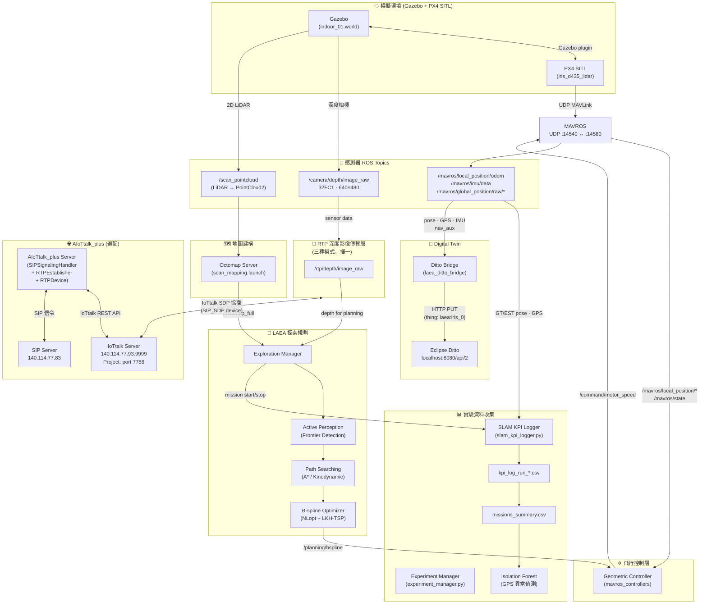
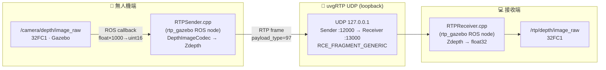
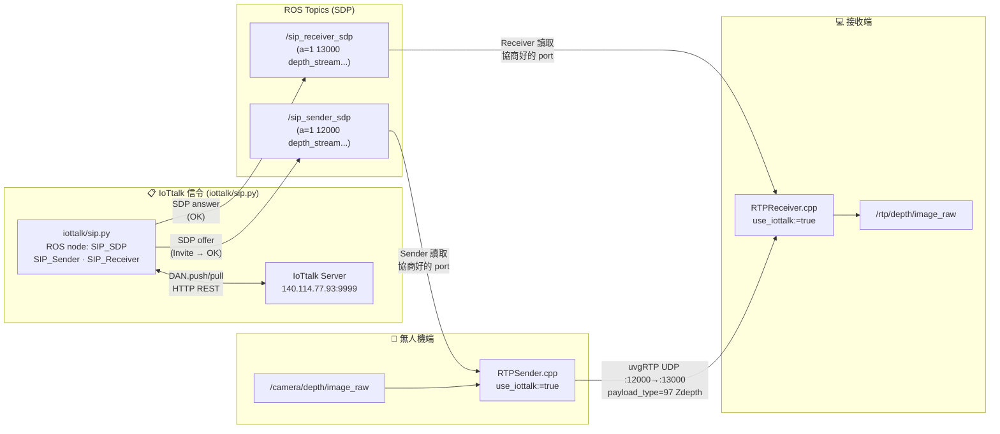
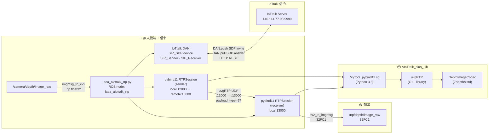
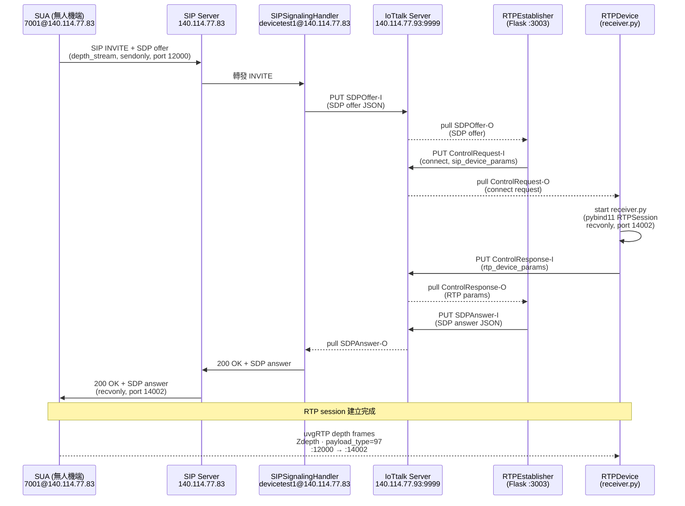

# LAEA 專案架構圖

## 一、系統整體架構

---

## 二、RTP 連線路徑（三種模式）

### 模式比較總覽

| | **Mode 1: nosip** | **Mode 2: iottalk** | **Mode 3: aiottalk_rtp** |
|---|---|---|---|
| 啟動方式 | 手動啟動 `rtp_gazebo` sender/receiver | 手動啟動 `rtp_gazebo` + `iottalk/sip.py` | `run_aiottalk_rtp.sh` |
| RTP 實現 | rtp_gazebo C++ | rtp_gazebo C++ | pybind11 uvgRTP (Python) |
| 信令 | 無（hardcoded port） | IoTtalk DAN push/pull | IoTtalk DAN push/pull |
| Sender port | 12000 | 協商後決定 | 12000 |
| Receiver port | 13000 | 協商後決定 | 13000 |
| Codec | Zdepth (zstd) | Zdepth (zstd) | Zdepth (zstd) |

---

### Mode 1 — nosip（直連，無信令）

---

### Mode 2 — iottalk（C++ + IoTtalk 信令橋接）

---

### Mode 3 — aiottalk_rtp（pybind11 + IoTtalk 信令，新）

---

## 三、AIoTtalk_plus 完整 SIP/IoTtalk 信令流程

> 此為 AIoTtalk_plus server 所支援的**完整 SIP 鏈路**（需 SIPSignalingHandler 啟動）。
> Mode 3 目前使用簡化版（直接 DAN push/pull，無真實 SIP）。

---

## 四、元件與目錄對應

| 元件 | 目錄 | 語言 |
|---|---|---|
| Gazebo 模擬環境 | `px4_gazebo/` | Launch/XML |
| 飛行控制器 | `mavros_controllers/geometric_controller/` | C++ |
| RTP 傳輸（Mode 1/2） | `rtp/`, `rtp_gazebo/` | C++ (ROS node) |
| RTP 傳輸（Mode 3） | `laea_aiottalk_rtp.py` | Python (ROS node) |
| RTP pybind11 library | `AIoTtalk_plus/AIoTtalk_plus_Lib/RTP/` | C++ + pybind11 |
| uvgRTP | `3rd/uvgRTP/`, `AIoTtalk_plus_Lib/3rd/uvgRTP/` | C++ |
| Octomap 地圖 | `laea_planner/octomap_mapping/` | C++ |
| 探索規劃 | `laea_planner/exploration_manager/` | C++ |
| IoTtalk DAN | `iottalk/DAN.py` | Python |
| IoTtalk SIP 橋接 | `iottalk/sip.py` | Python (ROS node) |
| AIoTtalk_plus Server | `AIoTtalk_plus/AIoTtalk_Server/AIoTtalk_plus/` | Python |
| AIoTtalk_plus SUA | `AIoTtalk_plus/SUA/rtp_SUA/` | Python |
| AIoTtalk_plus AUA | `AIoTtalk_plus/AUA/` | Python |
| Ditto Bridge | `laea_ditto_bridge/` | Python (ROS node) |
| 實驗管理 | `laea_twin_tools/scripts/` | Python |
| ML 異常偵測 | `train_isolation_forest.ipynb`, `data/` | Python/Jupyter |
