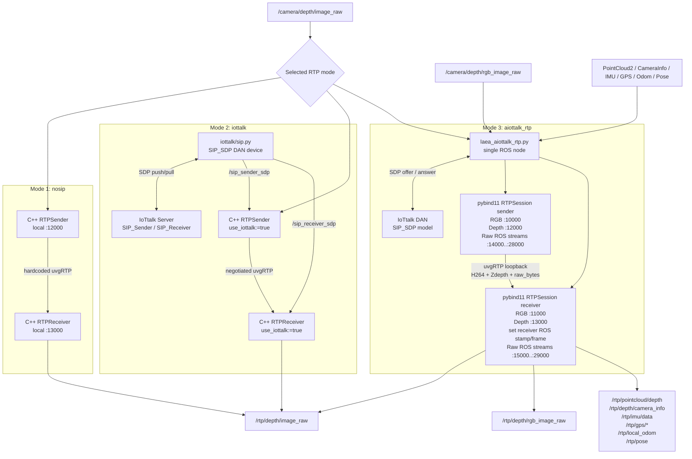
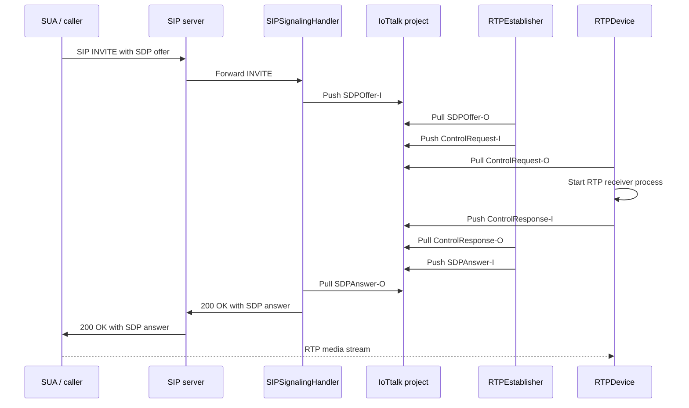
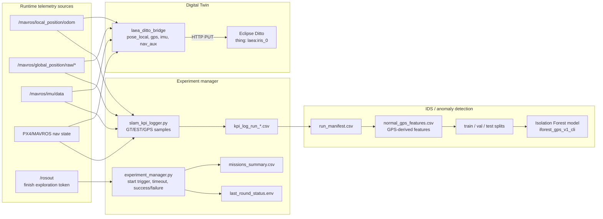

# LAEA Data Flow

This document focuses on how data moves through the LAEA runtime. It separates
runtime sensor/control data from signaling, logging, Digital Twin updates, and
IDS training data.

## 1. Baseline runtime flow: `run_nosip_depth.sh`

```mermaid
flowchart LR
    subgraph sim["Simulation and flight stack"]
        gazebo["Gazebo\nindoor_01.world\niris_d435_lidar"]
        px4["PX4 SITL"]
        mavros["MAVROS\nUDP :14540 <-> :14580"]
        gazebo <-->|"vehicle dynamics\nGazebo plugins"| px4
        px4 -->|"MAVLink"| mavros
    end

    subgraph sensors["ROS sensor and state topics"]
        depth_raw["/camera/depth/image_raw\nImage 32FC1, meters"]
        scan_raw["/scan\nLaserScan"]
        odom["/mavros/local_position/odom"]
        cam_pose["/mavros/camera/pose"]
        state["/mavros/state\nGPS, IMU, velocity"]
    end

    gazebo -->|"depth camera"| depth_raw
    gazebo -->|"2D lidar"| scan_raw
    mavros --> odom
    mavros --> cam_pose
    mavros --> state

    subgraph rtp["Depth RTP transport: nosip mode"]
        sender["rtp_gazebo RTPSender.cpp\nfloat32 meters -> uint16 millimeters\nDepthImageCodec + Zdepth"]
        udp["uvgRTP UDP loopback\nsender :12000 -> receiver :13000\npayload type 97"]
        receiver["rtp_gazebo RTPReceiver.cpp\nZdepth -> Image 32FC1"]
        depth_rtp["/rtp/depth/image_raw\nImage 32FC1, meters"]
        sender --> udp --> receiver --> depth_rtp
    end

    depth_raw --> sender

    subgraph mapping["Mapping"]
        depth_pc["depth image -> PointCloud2\n/depth_scan_pointcloud"]
        scan_pc["laser scan -> PointCloud2\n/scan_pointcloud"]
        octomap["octomap_server\nscan_mapping.launch"]
        map_ros["plan_env MapROS\nSDFMap + hybrid 2D map"]
        sdf_topics["/sdf_map/occupancy_*\n/sdf_map/hybrid_2d"]
    end

    depth_rtp -->|"depth for local map"| map_ros
    depth_rtp --> depth_pc
    scan_raw --> scan_pc
    depth_pc --> octomap
    scan_pc --> octomap
    octomap -->|"projected map / occupied space"| map_ros
    cam_pose -->|"sensor pose"| map_ros
    map_ros --> sdf_topics

    subgraph planner["LAEA exploration planner"]
        fsm["FastExplorationFSM"]
        frontier["FrontierFinder\nsmall area + isolated area costs"]
        manager["FastExplorationManager\nviewpoint selection + TSP"]
        search["A* / kinodynamic search"]
        bspline["B-spline optimization"]
        pos_cmd["/planning/pos_cmd\n/planning/bspline\n/travel_traj"]
        fsm --> frontier --> manager --> search --> bspline --> pos_cmd
    end

    odom --> fsm
    sdf_topics --> frontier
    map_ros --> manager

    subgraph control["Control loop"]
        controller["geometric_controller_node\nmavros_controllers"]
        setpoint["/mavros/setpoint_raw/attitude"]
        pos_cmd --> controller --> setpoint --> mavros
    end
```

## 2. RTP and signaling variants

Mode 3 now transports RGB/depth image streams with codecs and ROS telemetry
streams with `raw_bytes` RTP. PointCloud2 is downsampled before raw RTP when the
original D435 point cloud is too large for a stable raw RTP frame.
Decoded RGB/depth images are published with a receiver-side ROS timestamp and
`depth_camera_link` frame so that `MapROS` can synchronize RTP depth with
`/mavros/camera/pose` for occupancy-map updates.

## 3. Full AIoTtalk_plus control-plane flow

This is the full SIP/IoTtalk path supported by `AIoTtalk_plus`. The current
`laea_aiottalk_rtp.py` path is a simpler local-node variant of this flow.

## 4. Experiment, Digital Twin, and IDS data flow

## 5. Key topic contracts

| Data | Producer | Consumer | Notes |
|---|---|---|---|
| `/camera/depth/image_raw` | Gazebo depth camera | RTP sender | Source depth image, usually `32FC1` in meters. |
| `/rtp/depth/image_raw` | RTP receiver | Mapping and planner stack | Transported depth image after decode. |
| `/camera/depth/rgb_image_raw` | Gazebo D435i RGB stream | AIoTtalk RTP sender | Source RGB image for Mode 3 image transport. |
| `/rtp/depth/rgb_image_raw` | AIoTtalk RTP receiver | RViz / monitoring | H264-decoded RGB image, published as `bgr8`. |
| `/camera/depth/color/points` | Gazebo D435i point cloud | AIoTtalk RTP sender | Source `PointCloud2`; downsampled when needed before raw RTP. |
| `/rtp/pointcloud/depth` | AIoTtalk RTP receiver | RViz / monitoring / downstream consumers | RTP-restored `sensor_msgs/PointCloud2`. |
| `/camera/depth/camera_info` | Gazebo D435i camera info | AIoTtalk RTP sender | Source `CameraInfo` for depth camera. |
| `/rtp/depth/camera_info` | AIoTtalk RTP receiver | Depth consumers / monitoring | RTP-restored `CameraInfo`. |
| `/mavros/imu/data` | MAVROS | AIoTtalk RTP sender | Source `sensor_msgs/Imu`. |
| `/rtp/imu/data` | AIoTtalk RTP receiver | Monitoring / downstream consumers | RTP-restored IMU data. |
| `/mavros/global_position/raw/fix` | MAVROS GPS | AIoTtalk RTP sender | Source `NavSatFix`. |
| `/rtp/gps/fix` | AIoTtalk RTP receiver | Monitoring / downstream consumers | RTP-restored GPS fix. |
| `/mavros/global_position/raw/gps_vel` | MAVROS GPS | AIoTtalk RTP sender | Source `TwistStamped` GPS velocity. |
| `/rtp/gps/vel` | AIoTtalk RTP receiver | Monitoring / downstream consumers | RTP-restored GPS velocity. |
| `/mavros/global_position/raw/satellites` | MAVROS GPS | AIoTtalk RTP sender | Source `UInt32` satellite count. |
| `/rtp/gps/satellites` | AIoTtalk RTP receiver | Monitoring / downstream consumers | RTP-restored satellite count. |
| `/scan` | Gazebo lidar | scan-to-cloud conversion | 2D lidar source. |
| `/scan_pointcloud` | conversion node | octomap server | Lidar as `PointCloud2`. |
| `/mavros/local_position/odom` | MAVROS | planner, controller, logger | Main local odometry. |
| `/rtp/local_odom` | AIoTtalk RTP receiver | Monitoring / downstream consumers | RTP-restored local odometry. |
| `/mavros/camera/pose` | controller launch transforms | MapROS | Sensor pose for depth projection. |
| `/rtp/pose` | AIoTtalk RTP receiver | Monitoring / downstream consumers | RTP-restored camera pose. |
| `/sdf_map/hybrid_2d` | MapROS / SDF map | FrontierFinder | LAEA uses this for hybrid 2D frontier reasoning. |
| `/planning/pos_cmd` | exploration/planning stack | geometric controller | Control command path toward MAVROS/PX4. |
| `/rosout` | ROS nodes | experiment manager | Used to detect `finish exploration.`. |
