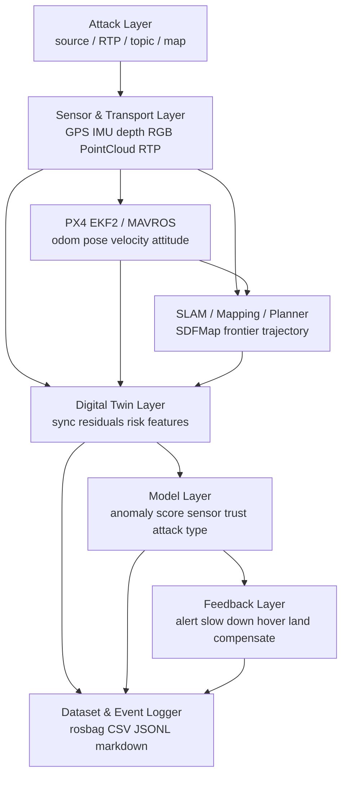
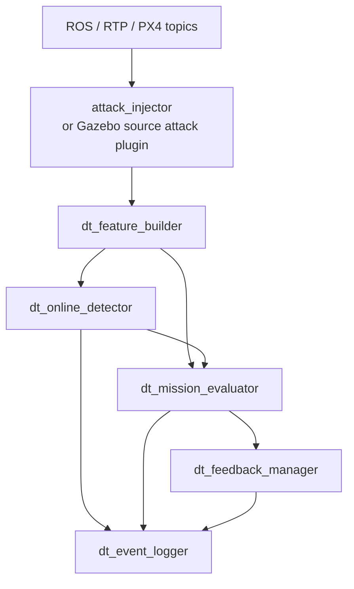

# ROS Digital Twin UAV Sensor Attack Detection 研究計畫

## 1. 研究定位

本專案的目標不是單純做 GPS spoofing detection，也不是只把 TranAD 套在 UAV flight data 上。比較有研究價值的定位是：

> 建立一個 ROS-native digital twin framework，用來觀測 UAV 多感測器、RTP 感測器傳輸、EKF2 狀態估計、SLAM/map/planner impact，並用 ML/DL time-series model 判斷感測器是否可信，以及任務是否還能安全繼續。

建議題目：

> RTP-aware ROS Digital Twin Framework for UAV Sensor Attack Detection and SLAM Mission Risk Assessment

中文題目：

> 基於 RTP 感知 ROS Digital Twin 的無人機感測器攻擊偵測與 SLAM 任務風險評估

核心貢獻應放在：

1. 在 ROS/Gazebo/PX4/MAVROS/LAEA planner 環境中建立可重現的 UAV sensor attack testbed。
2. 同時涵蓋 source-layer sensor attack、RTP-layer perception attack、EKF output anomaly、SLAM/planner mission impact。
3. 使用 digital twin 產生跨感測器一致性、通訊狀態、地圖狀態、任務風險與耗能特徵。
4. 使用 ML/DL time-series detector 做 anomaly detection、attack type classification 與 sensor trust estimation。
5. Feedback 採階段式設計，從告警、減速、安全降落到補償逐步推進。

## 2. 研究問題

| 編號 | 問題 | 目標 |
|---|---|---|
| RQ1 | AI 模型能否從多感測器時間序列偵測 UAV 感測器異常或攻擊？ | 建立 detection baseline 與 DL model comparison |
| RQ2 | 模型能否判斷是哪一類感測器或資料流異常？ | 輸出 sensor trust 與 suspected attack source |
| RQ3 | Digital twin feedback 是否能提升偵測與感測器歸因能力？ | 比較 raw-only 與 raw + DT residual features |
| RQ4 | 異常是否真的影響 SLAM/map/planner 任務？ | 建立 mission impact metrics |
| RQ5 | 根據異常程度，系統可以做到哪些 feedback？ | 分階段驗證告警、減速、hover、安全降落、補償 |

## 3. 系統分層架構



| Layer | 功能 | 本專案重點 |
|---|---|---|
| Attack layer | 注入可控異常 | GPS source attack、RTP depth attack、IMU/pose/odom/control attack 作對照 |
| Sensor & transport layer | 收集 raw sensor 與 RTP stream | GPS、IMU、depth、RGB、PointCloud、camera_info、RTP metadata |
| EKF / state layer | 觀測 estimator 輸出 | `/mavros/local_position/odom`、`/mavros/local_position/pose`、attitude、velocity |
| SLAM / planner layer | 觀測任務影響 | local map、frontier、trajectory、replan、coverage、collision warning |
| Digital twin layer | 計算一致性與風險特徵 | residuals、sensor consistency、transport quality、mission risk |
| Model layer | 偵測與歸因 | anomaly score、sensor trust、attack type、mission risk |
| Feedback layer | 回饋或緩解 | 告警、減速、hover、安全降落、補償 |
| Logger layer | 建資料集與實驗紀錄 | 正常/攻擊 rosbag、CSV features、event log、評估表 |

## 4. 目前 LAEA Planner 真正使用的資料

目前 LAEA exploration/planning stack 不是所有感測器都直接進入閉迴路。真正會影響建圖與尋路的是以下幾類。

| 類別 | Topic | 目前用途 | 是否走 RTP |
|---|---|---|---|
| Depth image | `/rtp/depth/image_raw` | 建立 local SDF/occupancy map | 是 |
| Camera pose | `/mavros/camera/pose` | 把 depth pixel 投影到 world frame | 否 |
| Odometry | `/mavros/local_position/odom` | planner 目前位置、速度、yaw、replan 起點 | 否 |
| 2D/Octomap hybrid map | `/projected_map/cv`, `/sdf_map/hybrid_2d` | 補充環境障礙與 frontier 判斷 | 間接 |

GPS、IMU、barometer、magnetometer 不是直接被 LAEA planner 讀取，但它們可能被 PX4 EKF2 融合後影響 odom/pose。因此如果要讓 GPS/IMU 攻擊真的影響飛行與 SLAM，攻擊點應該放在 EKF2 前面的 source layer，而不是只改 MAVROS 已經輸出的 ROS topic。

## 5. GPS/IMU Raw Data 與 Odom/Pose 的關係

實體或模擬無人機的狀態估計大致是：

```text
IMU / GPS / barometer / magnetometer / vision / range finder
        ↓
      PX4 EKF2
        ↓
vehicle attitude / local position / velocity
        ↓
      MAVROS
        ↓
/mavros/local_position/odom
/mavros/local_position/pose
```

各資料的意義：

| 資料 | 來源 | 意義 | 對研究的用途 |
|---|---|---|---|
| GPS raw | GPS sensor 或 Gazebo GPS plugin | 經緯度、高度、水平/垂直速度 | source-layer attack 與 sensor trust |
| IMU raw | IMU sensor | 加速度、角速度、姿態相關訊號 | motion consistency 與 future IMU attack |
| EKF2 | PX4 estimator | 融合多感測器估計機體狀態 | 真正影響控制與 MAVROS odom/pose |
| Odom | MAVROS local position odometry | local frame 的位置、速度、方向 | planner 目前狀態與 mission impact |
| Pose | MAVROS local position pose 或 camera pose | local frame 的位置與方向 | depth 投影、mapping、cross-sensor residual |

訓練模型時不應該只拿 raw GPS/IMU，也不應該只拿 odom/pose。建議兩者都用，但角色不同：

| 類型 | 角色 |
|---|---|
| Raw sensor features | 判斷源頭感測器是否異常 |
| EKF output features | 判斷攻擊是否影響狀態估計 |
| Digital twin residual features | 判斷感測器之間是否不一致 |
| SLAM/planner features | 判斷任務是否受到影響 |
| Gazebo ground truth | 只用於離線標籤與評估，不作為線上 detector 輸入 |

## 6. Attack Layer 設計

### 6.1 Source-layer attack

Source-layer attack 是最接近實體感測器攻擊的設計，攻擊會在 EKF2 前面發生，因此有機會影響 `/mavros/local_position/odom`、`/mavros/local_position/pose` 與飛行路徑。

目前已實作 GPS source attack plugin：

| 模式 | 意義 | 預期效果 |
|---|---|---|
| `bias` | GPS 位置逐步偏移 | EKF2 可能慢慢接受錯誤位置，odom/pose 漂移 |
| `jump` | GPS 位置瞬間跳變 | EKF2 可能 reject innovation 或產生明顯估計異常 |
| `freeze` | GPS 位置與速度固定 | 模擬 replay/freeze，速度與 motion 不一致 |
| `noise` | GPS position / velocity 增加隨機雜訊 | GPS residual 抖動，EKF innovation 變大 |
| `velocity_bias` | 只偏移 GPS velocity | 位置看似正常，但 EKF velocity/local position 可能逐步漂移 |

第一版 source-layer 主實驗建議使用：

```bash
GPS_ATTACK_MODE=bias
GPS_ATTACK_START_SEC=20
GPS_ATTACK_RAMP_SEC=10
GPS_ATTACK_EAST_BIAS_M=6
LAEA_PX4_SDF=iris_d435_lidar_gps_attack
```

### 6.2 RTP / perception attack

RTP attack 直接針對目前 SLAM 使用的 perception stream，對任務影響更直接。

| 攻擊對象 | 攻擊方式 | 可能影響 |
|---|---|---|
| `/rtp/depth/image_raw` | delay, drop, freeze, blackout, noise | 地圖錯誤、障礙消失、frontier 錯誤 |
| `/rtp/depth/rgb_image_raw` | delay, freeze, blackout | monitoring 異常，未來可接 vision detector |
| PointCloud | sparsify, drop, obstacle removal | 幾何密度異常，未來可接 perception consistency |
| CameraInfo | fx/fy/cx/cy tamper | depth projection 幾何失真 |

### 6.3 Topic-level attack

Topic-level attack 可用來做對照實驗，但不應該被包裝成實體感測器攻擊。

| 攻擊對象 | 定位 |
|---|---|
| `/mavros/local_position/odom` | estimator output attack 或 middleware attack |
| `/mavros/camera/pose` | mapping input attack |
| `/projected_map/cv`、`/sdf_map/hybrid_2d` | map-level tampering |

## 7. Digital Twin Layer 設計

Digital twin 不直接宣稱哪個感測器是 ground truth，也不直接取代 estimator。它的角色是把 ROS runtime 狀態轉成模型可用的 context-aware features。

> Digital twin 是 ROS 執行期觀測器，負責同步多感測器資料、計算跨感測器與通訊層殘差、估計任務風險，並將這些 feedback features 提供給異常偵測模型。

錯誤設計：

```text
GPS 是真相
GPS vs odom 不一致 -> odom 錯
```

正確設計：

```text
GPS、IMU、odom、pose、depth 都可能被攻擊
Digital twin 只計算不一致性與風險特徵
ML model 判斷 anomaly score、sensor trust、attack type
```

### 7.1 Transport / RTP features

| Feature | 意義 |
|---|---|
| `rtp_depth_hz` | depth RTP output 頻率 |
| `rtp_depth_timestamp_gap` | depth frame timestamp 間隔 |
| `rtp_depth_drop_score` | frame drop / missing pattern |
| `rtp_depth_latency_ms` | 傳輸延遲估計 |
| `rtp_payload_size` | RTP payload size 是否異常 |
| `rtp_repeat_frame_score` | replay / freeze pattern |

### 7.2 Motion consistency features

| Feature | 意義 |
|---|---|
| `odom_speed` | odom 線速度大小 |
| `odom_yaw_rate` | odom yaw 變化率 |
| `gps_odom_position_residual` | GPS local projection 與 odom 位置差 |
| `gps_odom_velocity_residual` | GPS velocity 與 odom velocity 差 |
| `imu_odom_acc_residual` | IMU acceleration 與 odom velocity derivative 的差 |
| `baro_odom_z_residual` | barometer altitude 與 odom z 的差 |
| `mag_odom_yaw_residual` | magnetometer heading 與 odom yaw 的差 |
| `pose_odom_position_residual` | camera pose 與 odom 位置差 |
| `pose_odom_yaw_residual` | camera pose 與 odom 方向差 |

### 7.3 Perception / map consistency features

| Feature | 意義 |
|---|---|
| `depth_valid_ratio` | depth 非 0 / 非 NaN pixel 比例 |
| `depth_mean_m` | depth 平均距離 |
| `depth_std_m` | depth 距離變異 |
| `depth_near_obstacle_ratio` | 近距離障礙比例 |
| `pointcloud_point_count` | PointCloud 點數 |
| `pointcloud_density_score` | 點雲密度是否異常 |
| `depth_pointcloud_residual` | depth 與 pointcloud 的幾何一致性 |
| `camera_info_change_score` | camera intrinsics 是否被竄改 |
| `local_map_update_rate` | local map 更新頻率 |
| `unknown_area_ratio` | unknown 區域比例 |
| `occupied_area_ratio` | occupied 區域比例 |

### 7.4 Planner / mission impact features

| Feature | 意義 |
|---|---|
| `frontier_count` | frontier 數量變化 |
| `frontier_selection_change` | frontier 選擇是否突然改變 |
| `replan_count` | planner 重新規劃次數 |
| `trajectory_tracking_error` | 實際 odom 與規劃軌跡差距 |
| `trajectory_collision_warning` | 規劃軌跡是否接近障礙 |
| `exploration_coverage` | 探索覆蓋率 |
| `mission_progress_rate` | 單位時間探索進度 |

### 7.5 Energy / control effort features

耗能在 SITL 中通常不是完全真實的電池模型，但可以作為相對比較特徵。

| Feature | 意義 |
|---|---|
| `battery_voltage` | MAVROS battery 電壓 |
| `battery_current` | MAVROS battery 電流 |
| `battery_power_w` | `voltage * current` |
| `motor_speed_sum` | 四個馬達轉速總和 |
| `motor_speed_cubic_sum` | 馬達耗能 proxy |
| `control_effort` | attitude/thrust command 變化量 |
| `energy_per_meter` | 單位距離耗能 |
| `energy_per_explored_area` | 單位探索面積耗能 |

## 8. Model Layer 設計

模型層的目標不只是 binary anomaly detection，而是同時輸出：

```text
/dt/anomaly_score
/dt/anomaly_flags
/dt/sensor_trust
/dt/attack_type
/dt/mission_risk
/dt/detector_debug
```

範例輸出：

```text
global_anomaly_score = 0.87
suspected_attack = gps_bias
mission_risk = high
sensor_trust:
  gps: 0.18
  imu: 0.77
  odom: 0.42
  depth_rtp: 0.83
  camera_pose: 0.71
```

### 8.1 Baseline models

| 模型 | 角色 |
|---|---|
| Rule-based residual threshold | 最基本 baseline，容易解釋 |
| Isolation Forest | 傳統 anomaly baseline |
| XGBoost / Random Forest | supervised attack classification baseline |
| LSTM Autoencoder | 傳統 sequence reconstruction baseline |
| TCN Autoencoder | 輕量 time-series baseline |

### 8.2 Main DL models

| 模型 | 角色 |
|---|---|
| TranAD | 代表性的 transformer-based multivariate anomaly baseline |
| Anomaly Transformer | attention association anomaly baseline |
| TimesNet | 新一點的 time-series comparison |
| PatchTST / iTransformer | 可作為後續更強的 time-series baseline |

TranAD 可以用，但不應該被包裝成主要創新。比較好的定位是：

> TranAD is used as a representative transformer-based multivariate time-series baseline. The contribution lies in ROS-native digital twin feedback, RTP-aware transport features, source-layer sensor attacks, sensor trust attribution, and SLAM mission-risk feedback.

### 8.3 Training 設計

| 訓練方式 | 輸入 | 輸出 | 用途 |
|---|---|---|---|
| Normal-only anomaly detection | 正常飛行資料 | anomaly score | 沒有完整 attack label 時可用 |
| Supervised attack classification | 正常 + attack label | attack type | 判斷 GPS bias、depth delay、IMU noise 等 |
| Sensor attribution | 多感測器 features + attack source label | sensor trust | 判斷哪個 sensor 可疑 |
| Mission risk prediction | features + mission impact label | mission risk | 判斷是否應該 feedback |

### 8.4 Ablation study

| 實驗 | 輸入 | 目的 |
|---|---|---|
| Raw only | GPS、IMU、depth、odom 等原始值 | 測模型基本能力 |
| Raw + EKF output | 加 odom、pose、velocity | 測 estimator output 是否有幫助 |
| Raw + DT residual | 加跨感測器 residual | 測 digital twin feedback 是否有幫助 |
| Raw + RTP | 加 delay/drop/jitter/replay | 測通訊層資訊是否有幫助 |
| Raw + DT + RTP + planner | 加 map/planner/mission features | 主方法 |
| Raw + DT + RTP + planner + energy | 加耗能與 control effort | 測任務風險與能耗是否更可分 |

## 9. Feedback Layer 階段性目標

Feedback 不應該一開始就做補償控制。比較安全且可發表的路線是循序漸進，把每一階段都變成可驗證目標。

| 階段 | 名稱 | 系統動作 | 適合第一版嗎 | 風險 |
|---|---|---|---|---|
| Level 0 | Detection + logging | 只記錄 anomaly、sensor trust、attack event | 是 | 低 |
| Level 1 | Alert | 發出 `/dt/anomaly_flags`、terminal/RViz 警告 | 是 | 低 |
| Level 2 | Slow down | 發出 `/dt/reduce_speed_request`，降低 planner 最大速度 | 可做 dry-run | 中 |
| Level 3 | Pause / hover | 發出 `/dt/pause_exploration` 或 hover request | 可做 dry-run，再做閉迴路 | 中 |
| Level 4 | Safe landing / RTL | 呼叫 land 或 PX4 mode 切換 | 第二版 | 中高 |
| Level 5 | Compensation | 用估計值替代或修正 sensor/odom/planner input | 後續版本 | 高 |

### 9.1 Level 0：Detection + Logging

第一版必做。

```text
/dt/residuals
/dt/sensor_trust
/dt/anomaly_score
/dt/anomaly_flags
/dt/event_log
```

驗收條件：

- 能記錄正常與攻擊 rosbag。
- 能記錄 attack start/end、attack type、attack source。
- 能輸出 anomaly score 與 sensor trust。
- 能比較 raw-only、raw+DT、raw+RTP、raw+DT+RTP+planner。

### 9.2 Level 1：Alert

模型只負責警告，不控制無人機。

範例：

```text
[DT_ALERT] gps_trust=0.18, mission_risk=high, suspected_attack=gps_bias
```

ROS output：

```text
/dt/anomaly_flags
/dt/sensor_trust
/dt/mission_risk
```

### 9.3 Level 2：Slow Down

當 sensor trust 降低但任務尚未失控時，digital twin 可以要求 planner 進入保守模式。

可能條件：

- GPS trust 下降，但 depth/map 仍穩定。
- RTP depth 出現 delay/drop，但尚未 blackout。
- odom residual 逐步變大但未超過安全閾值。

可能動作：

```text
/dt/reduce_speed_request = true
/dt/max_velocity_scale = 0.5
```

第一版建議先 dry-run，只記錄系統本來會不會要求減速，不直接控制飛機。

### 9.4 Level 3：Pause / Hover

當 perception 或 estimator 可信度不足時，停止繼續探索比繼續飛更安全。

可能條件：

- depth RTP blackout 超過 N 秒。
- camera pose 與 odom 嚴重不一致。
- GPS source attack 導致 odom/pose 大幅漂移。
- trajectory collision warning 增加。

可能動作：

```text
/dt/pause_exploration = true
/dt/hover_request = true
/dt/replan_required = true
```

這一層可以作為第二階段實作重點，因為它比補償安全，也比較容易驗證。

### 9.5 Level 4：Safe Landing / RTL

當模型判斷任務風險高，而且 SLAM 環境資訊不足時，最合理的 feedback 不是補償，而是讓無人機安全退出任務。

可能條件：

- Odom/pose 失真超過安全範圍。
- Depth/map 失效，無法保證避障。
- 多感測器 trust 同時下降。
- Detector 持續高分異常超過 N 秒。

可能動作：

```text
/dt/safe_mode_request = true
/geometric_controller/land
PX4 AUTO.LAND or RTL
```

這一層需要特別評估 false alarm，因為誤觸發會中斷任務。

### 9.6 Level 5：Compensation

補償是最有吸引力但風險最高的方向，建議放在第三版。

可能補償方式：

| 補償對象 | 方法 | 風險 |
|---|---|---|
| GPS | 用 IMU/vision/depth consistency 降低 GPS trust | 中 |
| Odom | 用 digital twin estimated residual 修正 odom | 高 |
| Camera pose | 用 odom/depth consistency 修正 pose | 高 |
| Depth | 用 temporal filter 或 pointcloud 補洞 | 中高 |
| Planner | 根據 trust 切換保守 planner 參數 | 中 |

暫時不建議第一版直接做：

- 用模型估計值取代 `/mavros/local_position/odom`
- 用補償後 pose 餵 mapping
- 用模型輸出直接改控制命令
- 合成 depth 給 planner

原因：

> 補償一旦進控制閉迴路，就必須證明 estimator 穩定性、時間同步、誤報率與控制安全性。第一版研究先不要把風險放大。

## 10. 建議 ROS Nodes



| Node | 功能 |
|---|---|
| `gps_attack_plugin` | 在 PX4 Gazebo GPS source 層注入 GPS bias/jump/freeze/noise |
| `attack_injector` | 對 RTP depth、pose、odom、map 等 ROS topic 做對照攻擊 |
| `dt_feature_builder` | 同步 topics，產生 raw features、RTP features、DT residuals |
| `dt_online_detector` | 載入模型，輸出 anomaly score、attack type、sensor trust |
| `dt_mission_evaluator` | 根據 SLAM/map/planner 狀態估計 mission risk |
| `dt_feedback_manager` | 根據 risk 發出 alert、slowdown、hover、land 或 compensation request |
| `dt_event_logger` | 寫 CSV / JSONL / rosbag / markdown，保留攻擊標籤與 detector output |

## 11. 實驗設計

### 11.1 Dataset collection

| Dataset | 內容 | 用途 |
|---|---|---|
| Normal SLAM | 無攻擊正常探索 | normal baseline |
| GPS source attack | bias/jump/freeze/noise/velocity_bias | source-layer estimator impact |
| RTP depth attack | delay/drop/freeze/blackout/noise | perception and map impact |
| IMU attack | bias/noise/freeze | future motion consistency |
| Mixed attack | GPS + RTP 或 IMU + depth | 測 multi-sensor attribution |

每筆資料應記錄：

```text
scenario_id
attack_source
attack_type
attack_start_time
attack_end_time
attack_parameters
rosbag_path
feature_csv_path
event_log_path
mission_result
```

### 11.2 Detection metrics

| Metric | 意義 |
|---|---|
| Precision | 報警中有多少是真的攻擊 |
| Recall | 攻擊有多少被抓到 |
| F1-score | precision/recall 平衡 |
| AUROC / AUPRC | anomaly score 排序品質 |
| Detection delay | 攻擊開始到偵測出來的時間 |
| False alarm rate | 正常飛行誤報率 |
| Attack type accuracy | 攻擊類型分類準確度 |
| Sensor attribution accuracy | 是否定位到正確 sensor |

### 11.3 Mission impact metrics

| Metric | 意義 |
|---|---|
| Odom-GT drift | EKF/local position 與 Gazebo ground truth 的偏差 |
| Trajectory deviation | 攻擊前後路徑偏差 |
| Map corruption score | occupancy / unknown / free 分佈變化 |
| Frontier selection change | frontier 選擇是否被攻擊影響 |
| Replan count | replan 次數是否暴增 |
| Collision warning count | 軌跡接近障礙次數 |
| Exploration coverage | 探索覆蓋率是否下降 |
| Mission completion rate | 任務是否完成 |

### 11.4 Feedback metrics

| Metric | 意義 |
|---|---|
| Alert delay | 異常到告警的時間 |
| Correct intervention rate | feedback 是否在需要時觸發 |
| False intervention rate | 正常任務中誤觸發 feedback 的比例 |
| Safe landing success rate | 安全降落是否成功 |
| Mission salvage rate | feedback 後是否能保住任務或降低損害 |
| Risk reduction | feedback 前後 mission risk 是否下降 |

### 11.5 Energy metrics

| Metric | 意義 |
|---|---|
| Total energy proxy | 任務總耗能 proxy |
| Energy per meter | 單位距離耗能 |
| Energy per explored area | 單位探索面積耗能 |
| Motor effort increase | 攻擊造成的馬達負載增加 |
| Control effort increase | 攻擊造成的控制命令震盪 |

## 12. 階段性 Roadmap

### Phase 0：目前已完成基礎

- AIoTtalk RTP depth/RGB 與多感測器 stream 基礎。
- GPS source attack plugin。
- `run_gps_attack_slam.sh` 可用最單純方式跑 SLAM + GPS bias attack。
- `gps_attack_monitor.py` 可觀察 GPS/odom 對 ground truth 的水平偏移。
- 初版研究方向與資料流文件。

### Phase 1：資料集與 feature builder

目標：

- 建立正常與 GPS attack rosbag。
- 建立 RTP depth attack rosbag。
- 實作 `dt_feature_builder`。
- 輸出固定頻率 feature CSV。
- 建立 attack event JSONL。

驗收：

- 每次實驗能重現 attack。
- 每筆資料都有 attack label 與 mission result。
- feature 欄位穩定，不會因 topic drop 造成格式變動。

### Phase 2：Offline model baseline

目標：

- 建立 rule-based、Isolation Forest、XGBoost、LSTM-AE、TranAD baseline。
- 做 raw-only vs raw+DT vs raw+RTP vs full features 比較。
- 輸出 detection、attribution、delay metrics。

驗收：

- 能證明 digital twin residual features 比 raw-only 更有幫助。
- 能定位 GPS source attack 與 RTP depth attack。

### Phase 3：Online detector prototype

目標：

- ROS node 線上載入模型。
- 即時輸出 `/dt/anomaly_score`、`/dt/sensor_trust`、`/dt/attack_type`。
- RViz/rqt_plot 或 terminal 顯示 detector output。

驗收：

- 攻擊發生後 N 秒內可看到 anomaly score 上升。
- sensor trust 能合理下降到被攻擊的 sensor。

### Phase 4：Feedback dry-run

目標：

- 實作 `dt_mission_evaluator`。
- 實作 `dt_feedback_manager` dry-run。
- 先只記錄 alert、slowdown、hover、land request，不真正控制飛機。

驗收：

- 高風險攻擊時能產生正確 feedback request。
- 正常飛行時 false intervention rate 低。

### Phase 5：安全 feedback 實作

目標：

- 先做 Level 2 slow down 或 Level 3 pause/hover。
- 再做 Level 4 safe landing。
- 補償控制留到最後。

驗收：

- Feedback 能降低 collision warning、map corruption 或 trajectory deviation。
- 不會因 detector 誤報造成不必要失控。

### Phase 6：Compensation 探索

目標：

- 根據 sensor trust 調整 planner 參數或 sensor weighting。
- 只在明確安全的模組做補償。
- 不直接用模型輸出改低階控制。

驗收：

- 補償後 mission impact 下降。
- 補償不會造成新的不穩定。

## 13. 與相似研究的區別

如果只做「GPS spoofing + onboard sensors + ML detection」，會和現有 UAV GPS spoofing detection 論文太接近。本專案應主打以下差異：

| 差異點 | 說明 |
|---|---|
| ROS-native digital twin | 不只是分類器，而是整合 ROS runtime、EKF、SLAM、planner、RTP 的觀測層 |
| RTP-aware sensing | 額外觀測感測器傳輸層 delay/drop/freeze/replay |
| Source + perception attacks | 同時包含 GPS source attack 與 depth RTP perception attack |
| Sensor trust attribution | 不只判斷 attack/normal，也判斷哪個 sensor 可疑 |
| Mission risk assessment | 不只看 detection accuracy，也看 SLAM map、frontier、trajectory、coverage |
| Feedback roadmap | 從告警到減速、安全降落、補償，形成完整 closed-loop safety 研究路線 |
| Energy/control effort | 加入攻擊造成的控制與耗能變化，作為任務層影響 |

## 14. 第一版實作範圍

第一版應聚焦在可重現、可訓練、可評估，不要過早做補償控制。

### Must have

- GPS source attack dataset。
- RTP depth attack dataset。
- `dt_feature_builder`。
- dataset logger。
- offline model baseline。
- online detector prototype。
- anomaly score + sensor trust output。
- mission impact metrics。
- markdown 實驗紀錄。

### Should have

- GPS/IMU raw data 與 odom/pose residual。
- RTP metadata features。
- RViz / rqt_plot visualization。
- feedback dry-run。
- energy/control effort features。

### Later

- planner slow down。
- pause exploration / hover。
- safe landing trigger。
- PX4 `AUTO.LAND` / RTL integration。
- compensation control。
- planner input switching。

## 15. 一句話總結

本專案第一版應聚焦在：

> 用 ROS digital twin feedback 將 UAV raw sensors、RTP 傳輸狀態、EKF odom/pose、SLAM map/planner impact 與 energy/control effort 轉成 time-series features，讓 ML/DL detector 判斷異常、定位可疑 sensor、評估任務風險，並以階段式 feedback 從告警逐步走向安全降落與補償。
