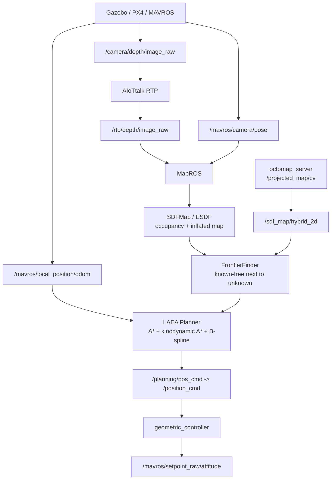
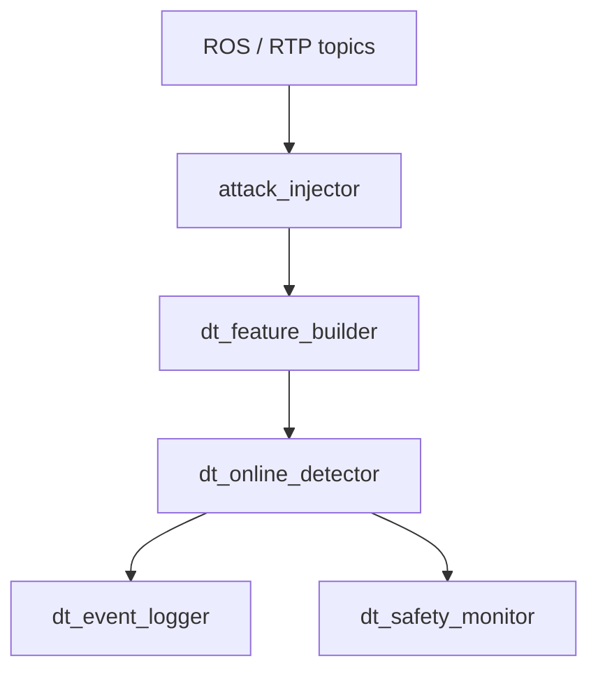

# UAV Digital Twin Sensor Attack Detection 規劃

## 1. 研究定位

本專案的核心不是單純把 TranAD 套在 UAV flight data 上，而是建立一個 ROS-native 的 UAV digital twin feedback layer，用來偵測多感測器與 RTP 資料流中的異常或攻擊。

建議研究主題：

> RTP-aware ROS Digital Twin Framework for UAV Sensor Attack Detection using Multivariate Time-Series Learning

中文可寫成：

> 基於 RTP 感知 ROS Digital Twin 的無人機多感測器攻擊偵測框架

主要貢獻應放在：

1. ROS/Gazebo/MAVROS/LAEA planner 下的多感測器資料收集與攻擊注入。
2. AIoTtalk RTP sensor stream 的傳輸與觀測。
3. Digital twin 對 UAV 狀態、感測器一致性、RTP 傳輸狀態的 feedback feature。
4. 使用 ML/DL time-series detector 做 anomaly detection 與 sensor trust estimation。
5. 第一版先做 detection + logging，高風險時提供 safety trigger；補償控制放到後續版本。

## 2. 目前 Planner 真正使用的資料

目前 LAEA exploration/planning stack 不是所有感測器都吃進去。真正會影響建圖與尋路的是以下幾類。

| 類別 | Topic | 目前用途 | 是否走 RTP |
|---|---|---|---|
| Depth image | `/rtp/depth/image_raw` | 建立 local SDF/occupancy map | 是 |
| Camera pose | `/mavros/camera/pose` | 把 depth pixel 投影到 world frame | 否 |
| Odometry | `/mavros/local_position/odom` | planner 目前位置、速度、yaw、replan 起點 | 否 |
| 2D/Octomap hybrid map | `/projected_map/cv`, `/sdf_map/hybrid_2d` | 補充環境障礙與 frontier 判斷 | 間接 |

其他已接上 RTP 的感測器，例如 GPS、IMU、RGB、PointCloud、camera_info，目前主要是 monitoring / detector / dataset 用，不直接進 LAEA planner 閉迴路。

## 3. 目前資料流



關鍵邏輯：

- Depth image 只表示每個 pixel 距離相機多遠。
- Camera pose 決定這張 depth image 要被放到世界座標哪裡。
- SDFMap 透過 raycasting 將 depth 轉成 free / occupied / unknown voxel。
- FrontierFinder 找已知 free space 與 unknown space 的邊界。
- Planner 根據 odom 的目前位置與速度，規劃下一段 trajectory。

## 4. Digital Twin 的角色

Digital twin 不應該只是視覺化，也不應該直接把 GPS 或任何單一感測器當成 ground truth。

本專案中的 digital twin 建議定義為：

> ROS runtime observer that synchronizes UAV sensor streams, computes cross-sensor and transport residuals, estimates sensor trust, and feeds context-aware features into the anomaly detector.

中文：

> Digital twin 是 ROS 執行期觀測器，負責同步多感測器資料、計算跨感測器與通訊層殘差、估計感測器可信度，並將這些 feedback features 提供給異常偵測模型。

Digital twin 只產生 features，不直接當裁判。

錯誤設計：

```text
GPS 是真相
GPS vs odom 不一致 -> odom 錯
```

正確設計：

```text
GPS、odom、pose、IMU、depth 都可能被攻擊
Digital twin 只計算不一致性
ML model 判斷 anomaly score 與 sensor trust
```

## 5. Digital Twin Feedback Features

建議第一版產生以下 features。

### 5.1 Transport / RTP features

| Feature | 意義 |
|---|---|
| `rtp_depth_hz` | depth RTP output 頻率 |
| `rtp_depth_timestamp_gap` | depth frame timestamp 間隔 |
| `rtp_depth_drop_score` | frame drop / missing pattern |
| `rtp_depth_latency_ms` | 傳輸延遲估計 |
| `rtp_payload_size` | RTP payload size 是否異常 |
| `rtp_repeat_frame_score` | replay / freeze pattern |

### 5.2 Motion consistency features

| Feature | 意義 |
|---|---|
| `odom_speed` | odom 線速度大小 |
| `odom_yaw_rate` | odom yaw 變化率 |
| `pose_odom_position_residual` | camera pose 與 odom 位置差 |
| `pose_odom_yaw_residual` | camera pose 與 odom 方向差 |
| `imu_odom_acc_residual` | IMU acceleration 與 odom velocity derivative 的差異 |
| `gps_odom_position_residual` | GPS local projection 與 odom 差異 |
| `gps_odom_velocity_residual` | GPS velocity 與 odom velocity 差異 |

### 5.3 Perception consistency features

| Feature | 意義 |
|---|---|
| `depth_valid_ratio` | depth 非 0 / 非 NaN pixel 比例 |
| `depth_mean_m` | depth 平均距離 |
| `depth_std_m` | depth 距離變異 |
| `depth_near_obstacle_ratio` | 近距離障礙比例 |
| `pointcloud_point_count` | PointCloud 點數 |
| `pointcloud_density_score` | 點雲密度是否異常 |
| `depth_pointcloud_residual` | depth 與 pointcloud 的幾何一致性 |
| `camera_info_change_score` | camera intrinsics 是否被竄改 |

### 5.4 Planner / map impact features

| Feature | 意義 |
|---|---|
| `frontier_count` | frontier 數量變化 |
| `unknown_area_ratio` | unknown 區域比例 |
| `occupied_area_ratio` | occupied 區域比例 |
| `local_map_update_rate` | local map 更新頻率 |
| `replan_count` | planner 重新規劃次數 |
| `trajectory_collision_warning` | 規劃軌跡是否接近障礙 |

## 6. 模型定位

TranAD 可以使用，但不應該被包裝成主要創新。

建議定位：

> TranAD is used as a representative transformer-based multivariate time-series baseline. The contribution lies in ROS-native digital twin feedback, RTP-aware transport features, sensor attack injection, and online anomaly logging.

中文：

> TranAD 作為具代表性的 transformer-based 多變量時間序列 baseline。主要貢獻在 ROS-native digital twin feedback、RTP-aware transport features、感測器攻擊注入與 online anomaly logging。

建議模型組合：

| 模型 | 角色 |
|---|---|
| LSTM Autoencoder | 傳統 baseline |
| TCN Autoencoder | 輕量 time-series baseline |
| TranAD | 主要 transformer baseline |
| Anomaly Transformer | 強 attention baseline |
| TimesNet | 新一點的 time-series comparison |

模型輸出不要只有 global anomaly score，應包含 sensor-level attribution。

建議輸出：

```text
/dt/anomaly_score
/dt/anomaly_flags
/dt/sensor_trust
/dt/attack_type
/dt/detector_debug
```

範例：

```text
global_anomaly_score = 0.87
suspected_attack = depth_rtp_delay
sensor_trust:
  depth_rtp: 0.21
  camera_pose: 0.81
  odom: 0.86
  imu: 0.73
  gps: 0.65
```

## 7. 攻擊設計

### 7.1 主實驗攻擊

這些會直接影響目前建圖或尋路，應該放在第一版主實驗。

| 攻擊對象 | 攻擊方式 | 可能影響 |
|---|---|---|
| `/rtp/depth/image_raw` | delay, drop, freeze, blackout, noise | 地圖錯誤、障礙消失、frontier 錯誤 |
| `/mavros/camera/pose` | freeze, bias, replay, yaw spoofing | depth 被投影到錯誤位置，地圖歪斜 |
| `/mavros/local_position/odom` | freeze, drift, jump, replay | planner 從錯誤起點規劃 |
| `/projected_map/cv` 或 hybrid map | obstacle removal, false obstacle, unknown tamper | frontier 選錯、避障錯誤 |
| PX4 Gazebo GPS source | bias, jump, freeze, noise, velocity bias | 影響 EKF2，進而改變 MAVROS odom/pose |

### 7.2 次要實驗攻擊

這些目前不直接影響 planner，但適合作為 digital twin sensor trust 與 attack localization 的案例。

| 攻擊對象 | 攻擊方式 | 用途 |
|---|---|---|
| GPS | spoof, jump, freeze, satellite count tamper | 測試 cross-sensor consistency |
| IMU | bias, noise, freeze | 測試 motion residual |
| RGB | freeze, delay, blackout | monitoring / future perception |
| PointCloud | sparsify, drop, obstacle removal | perception consistency |
| CameraInfo | fx/fy/cx/cy tamper | camera calibration tamper detection |

重要限制：

> 目前 GPS / IMU 的 ROS topic copy 不直接回饋 PX4 estimator，因此攻擊它們不一定會造成飛行路徑變化。這些攻擊應定義為 sensor-trust / localization 實驗，而不是 mission-impact 實驗。

第一版 GPS mission-impact 實驗改走 source-layer injection：使用 `px4_gazebo/gps_attack` 新增的 PX4 Gazebo GPS attack plugin，讓攻擊資料在 EKF2 前進入 PX4，而不是修改 `/mavros/global_position/raw/fix`。

## 8. Feedback 與 Mitigation 路線

### 8.1 第一版：Detection + Logging

第一版先做：

```text
/dt/residuals
/dt/sensor_trust
/dt/anomaly_score
/dt/anomaly_flags
/dt/event_log
```

目標：

- 建立正常與攻擊資料集。
- 記錄每次攻擊的時間、topic、attack type。
- 比較 raw-only、raw+RTP、raw+DT residual、raw+RTP+DT residual。
- 驗證 digital twin feedback 是否提升 anomaly detection 與 sensor attribution。

### 8.2 第二版：Safety Trigger

高風險異常時，先做保守 feedback：

```text
/dt/safe_mode_request
/dt/pause_exploration
/dt/reduce_speed_request
/dt/replan_required
```

建議觸發條件：

- depth RTP blackout 持續超過 N 秒。
- odom freeze 或 jump。
- camera pose 與 odom 嚴重不一致。
- planner trajectory collision warning 增加。

安全策略：

- pause exploration
- hover
- call `/geometric_controller/land`
- 後續可改用 PX4/MAVROS `AUTO.LAND` 或 RTL

### 8.3 第三版：Compensation

第三版才考慮真正補償。

暫時不建議第一版做：

- 用 digital twin 估計值取代 `/mavros/local_position/odom`
- 用補償後 pose 餵 planner
- 用模型輸出直接改控制命令
- 合成 depth 給 mapping/planner

原因：

> 補償一旦進控制閉迴路，就必須證明 estimator 穩定性、時間同步、誤報率與控制安全性。第一版研究先不要把風險放大。

## 9. 建議 ROS Nodes



| Node | 功能 |
|---|---|
| `attack_injector` | 對 depth、pose、odom、GPS、IMU、map 等 topic 注入攻擊 |
| `dt_feature_builder` | 同步 topics，產生 raw features、RTP features、DT residuals |
| `dt_online_detector` | 載入模型，輸出 anomaly score 與 sensor trust |
| `dt_event_logger` | 寫 CSV / rosbag / JSONL，保留攻擊標籤與 detector output |
| `dt_safety_monitor` | 根據 anomaly risk 發出 pause / land / safe mode request |

## 10. 評估設計

### 10.1 Detection metrics

| Metric | 意義 |
|---|---|
| Precision | 報警中有多少是真的攻擊 |
| Recall | 攻擊有多少被抓到 |
| F1-score | precision/recall 平衡 |
| Detection delay | 攻擊開始到偵測出來的時間 |
| False alarm rate | 正常飛行誤報率 |
| Sensor attribution accuracy | 是否定位到正確 sensor |

### 10.2 Mission impact metrics

只對 depth、camera pose、odom、hybrid map 等會影響 planner 的攻擊使用。

| Metric | 意義 |
|---|---|
| Trajectory deviation | 攻擊前後路徑偏差 |
| Replan count | replan 次數是否暴增 |
| Frontier selection change | frontier 選擇是否被攻擊影響 |
| Map corruption score | occupancy / unknown / free 分佈變化 |
| Collision warning count | 軌跡接近障礙次數 |
| Exploration coverage | 探索覆蓋率是否下降 |

### 10.3 Ablation study

| 實驗 | 輸入 | 目的 |
|---|---|---|
| Raw only | 原始 sensor values | 測模型基本能力 |
| Raw + RTP | 加 RTP delay/drop/jitter | 測通訊層資訊是否有幫助 |
| Raw + DT residual | 加 digital twin residual | 測 DT feedback 是否有幫助 |
| Raw + RTP + DT residual | 全部 | 主方法 |

## 11. 第一版實作範圍

建議第一版不要太大，先完成以下範圍。

### Must have

- depth RTP attack injection
- camera pose attack injection
- odom attack injection
- dt_feature_builder
- dataset logger
- offline training pipeline
- online detector prototype
- anomaly score + sensor trust output
- markdown 實驗紀錄

### Should have

- GPS / IMU 作為 sensor-trust 次要實驗
- RTP metadata features
- RViz / rqt_plot visualization
- safety monitor dry-run，不真的控制飛機

### Later

- planner pause
- safe landing trigger
- PX4 `AUTO.LAND` / RTL integration
- compensation control
- planner input switching

## 12. 一句話總結

本專案第一版應聚焦在：

> 用 ROS digital twin feedback 將 UAV 多感測器資料、RTP 傳輸狀態與 planner/map impact 轉成 time-series features，讓 ML/DL detector 判斷異常、定位可疑 sensor，並完整記錄事件；安全降落與補償控制作為後續延伸。
