# FedDroneLab × LAEA 系統架構（2026-07-28）

此圖描述兩台機器的實際責任邊界與資料閉環。實線為已實作或正在執行的路徑；虛線為資料達標後才啟用、或仍待完成的論文實驗／部署工作。

```mermaid
flowchart LR
  classDef running fill:#DCFCE7,stroke:#15803D,color:#14532D,stroke-width:2px;
  classDef active fill:#DBEAFE,stroke:#2563EB,color:#172554,stroke-width:2px;
  classDef planned fill:#FEF3C7,stroke:#D97706,color:#78350F,stroke-dasharray: 5 5;
  classDef storage fill:#F3E8FF,stroke:#7E22CE,color:#3B0764;
  classDef safety fill:#FEE2E2,stroke:#DC2626,color:#7F1D1D;

  subgraph SIM["UAV Simulator / Edge Host — <SIM_TAILSCALE_IP>\nLAEA 專案；產生資料、線上偵測與回應"]
    direction TB

    subgraph FLIGHT["模擬飛行與自主探索"]
      direction LR
      MAPS["四張正常飛行地圖\nindoor_01 · indoor_02\nlab_corridor_01 · lab_rooms_01"]
      GZ["Gazebo + PX4 SITL\nUAV 動力學／感測器"]
      MAV["MAVROS + geometric controller\nOFFBOARD／arming"]
      RTP["Depth RTP loopback (nosip)\n2D LiDAR / depth stream"]
      SLAM["FAEP / octomap\n自主探索、定位與建圖"]
      MAPS --> GZ --> MAV
      GZ --> RTP --> SLAM
      MAV --> SLAM
    end

    ATTACK["可控攻擊注入（另行蒐集）\nGPS bias / velocity · IMU gyro · barometer"]
    ATTACK --> GZ

    KPI["slam_kpi_logger\n52 欄 KPI @ 20 Hz"]
    SLAM --> KPI
    MAV --> KPI

    LOGS[("laea_logs/\n每趟 KPI CSV + run_manifest")]
    QUALITY["資料治理\nSUCCESS_FINISH → quality manifest\nmap/run 唯一 ID、CSV/world SHA-256\n每圖 run-level split"]
    KPI --> LOGS --> QUALITY

    subgraph EDGE["線上異常偵測與安全回應"]
      direction LR
      ONNX["T-UAV inference node\nONNX LSTM-AE（10 Hz）"]
      SCORE["/laea/detector/score\nFloat64 anomaly score"]
      STATE["mission_state_node\ndegraded / critical"]
      SUP["mission_supervisor + feedback actuator\n降級、hover、任務回應"]
      ONNX --> SCORE --> STATE --> SUP
      SUP --> MAV
    end

    MAV --> ONNX
    RTP --> ONNX
  end

  TRANSFER["受控資料傳輸\nCSV + immutable registry\n（完成品質檢查後）"]
  QUALITY -. "批准的正常／攻擊資料" .-> TRANSFER

  subgraph GPU["GPU Server — <GPU_TAILSCALE_IP>\nFedDroneLab；離線訓練與模型匯出"]
    direction TB

    STAGING[("feddronelab-data/\n四圖 per-run CSV + manifest")]
    MANIFEST["訓練 manifest 驗證\nrun-level train / val / test\n僅 train fit normalization"]
    TRANSFER --> STAGING --> MANIFEST

    subgraph TRAIN["模型訓練與評估"]
      direction LR
      C1["C1：集中式 LSTM-AE\nnormal-only baseline"]
      C3["C3：K3s + gRPC + FedAvg\n每張地圖 = 一個 client"]
      EVAL["離線評估\nFPR、P/R/F1、偵測延遲\ncentralized vs FedAvg\nglobal/local/hybrid threshold"]
      MANIFEST --> C1 --> EVAL
      MANIFEST -. "每圖 client partition" .-> C3 -.-> EVAL
    end

    EXPORT["部署 bundle\nmodel.onnx · norm.json\nthresholds.json · feature columns"]
    C1 --> EXPORT
    C3 -. "完成後" .-> EXPORT

    C2["C2：GPU relocalization / migration Pod\n論文規劃，尚未實作"]
  end

  EXPORT -. "受控部署回 Edge" .-> ONNX
  SUP -. "異常恢復請求（未完成）" .-> C2
  C2 -. "恢復結果（未完成）" .-> SUP

  class MAPS,GZ,MAV,RTP,SLAM,KPI,LOGS,QUALITY running;
  class ATTACK,TRANSFER,STAGING,MANIFEST,C1,EXPORT active;
  class ONNX,SCORE,STATE,SUP safety;
  class C3,EVAL,C2 planned;
```

## 元件狀態與責任

| 區域 | 已知現況 | 責任 |
|---|---|---|
| SIM / LAEA | 正在四圖正常資料 campaign；採 nosip，失敗 run 不納入正常資料 | 模擬飛行、KPI、資料品質、線上偵測與安全回應 |
| GPU / FedDroneLab | 已有初階集中式訓練與 ONNX 匯出驗證；正式四圖資料集尚未凍結 | 離線訓練、模型比較、產生部署 bundle |
| C1 集中式 LSTM-AE | 已做初階驗證；正式版本待每圖至少 12 成功 run | 作為 FedAvg 的公平比較基準 |
| C3 FedAvg | 論文核心，尚待以四圖資料建立 client partition 與完整實驗 | 比較跨環境／多 client 的聯邦訓練 |
| C2 migration / relocalization Pod | 僅在論文規劃中 | 異常後的 GPU 協助恢復；不可宣稱已完成 |

## 資料與控制閉環

1. SIM 上的 UAV 在指定地圖完成自主探索，KPI logger 寫入每趟 CSV 與 outcome manifest。
2. 只有 `normal + nosip + SUCCESS_FINISH + quality_ok=1` 的 run 進入 immutable registry；切分單位是整趟任務，避免滑動視窗跨 train/test 洩漏。
3. 批准資料傳至 GPU，以同一份 manifest 執行 C1 或 C3；validation 校正閾值，test 僅量測 held-out 表現。
4. GPU 匯出 ONNX、normalization 與 threshold bundle，受控部署回 SIM 的 inference node。
5. 線上 score 發布到 `/laea/detector/score`，由 mission state 與 supervisor 決定降級／hover 等安全回應。
